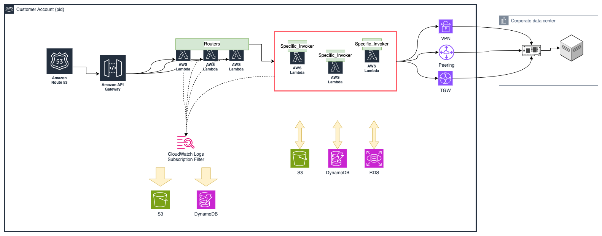

# Concepts

## Service Details

1. Our EAI solution provides seamless integration across multiple applications, systems, and data sources within the enterprise, enabling data consistency, real-time data flow, and business process automation.

2. Targeted at mid-large-sized companies requiring large-scale data and system integration, especially IT departments and technical teams in various industries such as finance, manufacturing, healthcare, and retail.

3. Based on AWS infrastructure, we can provide flexibility, scalability and professional technical support and customized integration services to meet customers' specific requirements.

## Characteristics of target customers

1. Mid-large-sized companies: Companies that require large-scale data and system integration and operate complex IT infrastructure.

2. Various industries: Companies that feel the need for data integration and business process automation in various industries such as finance, manufacturing, healthcare, and retail.

3. IT departments and technical teams: Technical personnel and managers with needs for system integration, data management, and business process optimization.

## Customer Engagement Mechanisms

### Initial Consultation and Needs Assessment

1. Discovery Meetings: Conduct initial meetings to understand the customer's current systems, integration needs, and business objectives.
2. Requirements Gathering: Collect detailed requirements from stakeholders through interviews, surveys, and workshops.

### Planning

1. Detailed Project Planning: Develop a comprehensive project plan that includes timelines, milestones, and resource allocation.

2. Technical Design Sessions: Collaborate with the customer’s IT team to design the architecture and integration flows.

## Delivery Mechanisms

### Implementation and Configuration

1. Cloud Deployment: Utilize cloud-native deployment models to ensure scalability and flexibility.

2. Custom Adapters: Develop and configure custom adapters to integrate with the customer's specific systems and protocols.

3. Secure Connections: Implement secure connection mechanisms like VPN, DirectConnect, and Transit Gateway (TGW) to ensure data privacy and security.

### Training and Documentation

1. User Training: Provide comprehensive training sessions for end-users and administrators.

2. Technical Documentation: Deliver detailed documentation on system configuration, workflows, and maintenance procedures.

3. Knowledge Transfer: Conduct knowledge transfer sessions to ensure the customer’s team is equipped to manage the solution.

### Go-Live and Post-Implementation Support

1. Go-Live Support: Offer on-site or remote support during the go-live phase to address any immediate issues.

2. Monitoring and Optimization: Implement monitoring tools to track system performance and optimize as needed.

3. Ongoing Maintenance: Provide ongoing maintenance and support services to ensure long-term success and address any evolving needs.
