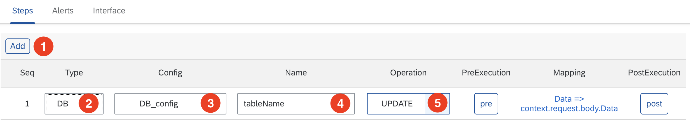

# DB Step 추가

DB와 관련된 작업을 진행하는 Step입니다.

1. "Steps" tab에서 "Add"➊ 버튼을 클릭합니다.
     
2. "Type"➋ 컬럼에서 "DB"를 선택합니다.
3. "Config"➌ 컬럼에서 접근할 DB의 접속설정을 선택합니다.
4. "Name"➍ 컬럼에는 Table 명을 입력합니다.
5. "Opreation"➎ 컬럼에서 DB에서 수행할 작업을 선택합니다. 
6. "PreExecution"에는 현재 Step이 실행하기 전에 필요한 함수를 실행하기 위한 소스코드를 입력할 수 있습니다.
7. "Mapping" 컬럼의 링크를 클릭하면 Step의 Input, Output에 변수 경로를 지정할수 있습니다.

    | Input | Output |
    |:-------------:|:--------------:|
    |  |  |

8. "PostExecution"에는 현재 Step이 실행 완료한 후 필요한 함수를 실행하기 위한 소스코드를 입력할수 있습니다.