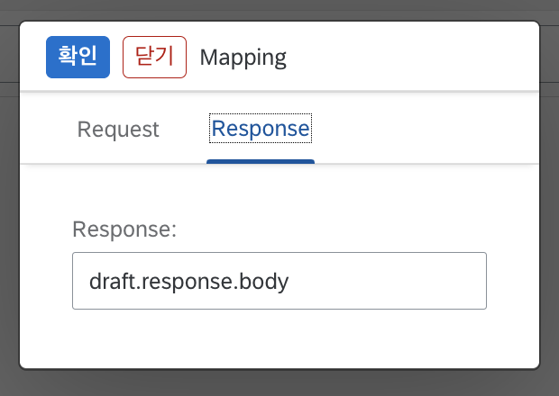

# RFC Step 추가

SAP RFC 함수를 호출하는 Step입니다.

> * SAP RFC 함수를 호출하려면 사전에 SAP 서버와 통신할수 있게 네트워크 연결을 해야 합니다. [사전준비사항](/eai/prerequisites.md)을 확인해보세요.
> * Config를 선택하려면 미리 [Config 추가](/eai/add_config)를 해야 합니다.

1. "Steps" tab에서 "Add" 버튼을 클릭합니다.
    
2. "Type" 컬럼에서 "RFC"를 선택합니다.
3. "Config" 컬럼에서 SAP RFC 함수를 호출할때 사용할 접속정보를 선택합니다.
4. "Name" 컬럼에 RFC 함수명을 직접 입력하거나 `인터페이스 ID`에 지정된 RFC 함수명`Function.Name`을 통해 동적으로 적용할수 있습니다.
5. "PreExecution"에는 현재 Step이 실행하기 전에 필요한 함수를 실행하기 위한 소스코드를 입력할수 있습니다.
6. "Mapping" 컬럼의 링크를 클릭하면 Step의 Input, Output에 변수 경로를 지정할수 있습니다.

    | Input | Output |
    |:-------------:|:--------------:|
    |  |  |

7. "PostExecution"에는 현재 Step이 실행 완료한 후 필요한 함수를 실행하기 위한 소스코드를 입력할수 있습니다.
