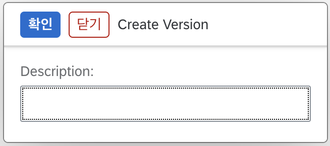

## Config 생성

RFC, DB 접속정보를 시스템 환경에 맞춰 설정할 수 있습니다.

1. "Config List" 페이지에서 "Create" 버튼을 누릅니다.
  
2. "Type"에서 접속정보의 Data Type을 선택합니다. 
3. "Name"에 Config 이름을 입력합니다.
  
4. 시스템 환경에 따라 알맞은 접속정보를 입력합니다.
  
5. "Save" 버튼을 누릅니다.
   
## Config 배포

 Config 생성 후, Version을 만들고 배포 작업을 완료해야 [Step 추가](/eai/functions/add_step)시 Config 정보를 사용할 수 있습니다.

### Version 생성
1. "Config List" 페이지에서 배포를 실행할 Config를 선택합니다.
  
2. "Versions" 버튼을 클릭합니다.
  
3. "Create Version" 버튼을 클릭합니다.
  
4. 해당 Version의 간략한 정보를 "Description"에 입력합니다.
  
5. "확인" 버튼을 클릭합니다.

### Version 배포
1. "Versions" 버튼을 클릭합니다.
  
2. 배포하려는 Version의 "Deploy" 버튼을 클릭합니다.
  
3. Deploy가 정상적으로 완료되면 Deployed 컬럼의 체크박스가 체크되고, "Deploy" 버튼은 비활성화됩니다.
  