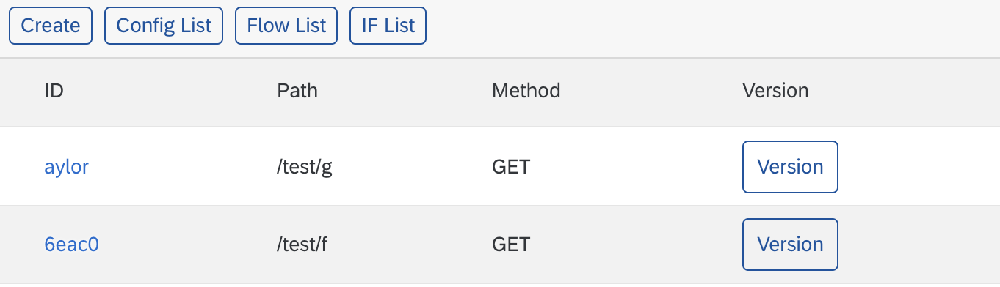
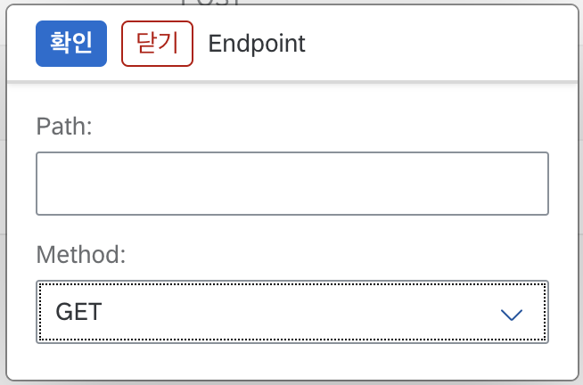

# Create Endpoint

## Endpoint 생성하기
`Path`와 `Method` 설정만으로 간편하게 Endpoint를 만들 수 있습니다.

1. "Endpoint List" 페이지에서 "Create" 버튼을 클릭합니다.
   
2. Endpoint 정보를 입력합니다.

    |UI|
Description
|
    |:---:|----------|
    ||  <ul style="font-size: .8rem;"><li>**Path**는 Endpoint에서 사용할 주소입니다. 첫 문자는 항상 `/`(슬래시)로 시작해야 합니다. 소문자 영문자와, 숫자, -(하이픈)과 _(밑줄)만 허용됩니다.</li><li>**Method**는 HTTP 메서드 입니다.</li></ul>|

3. "확인" 버튼을 누릅니다.