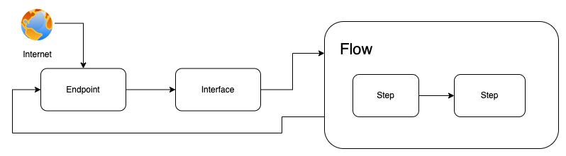
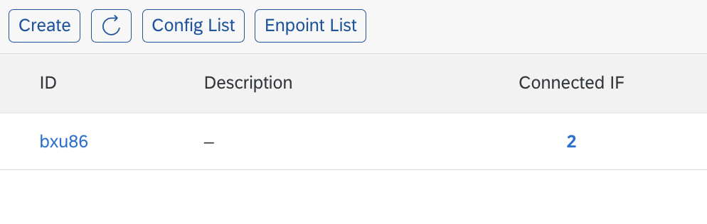
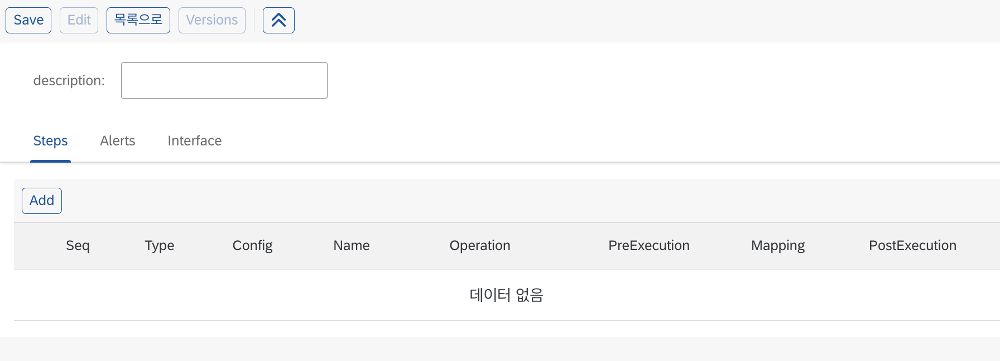

# Create Flow

## What is Flow?

Flow는 또 다른 말로 Pattern(패턴)이라고도 불립니다. 인터페이스와 1:1 관계가 아닌 n개 인터페이스와 

Flow에서 인터페이스 로직을 구현하고 인터페이스 ID를 생성합니다.

## Flow 생성하기

1. "Flow 리스트" 화면으로 들어가서 "생성" 버튼을 클릭합니다.
    
2. "Description"에 Flow에 대한 설명을 입력합니다.
    
3. "저장" 버튼을 클릭합니다.

## 다음 순서

[Step 추가하기](add_step.md)
