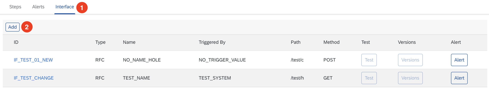
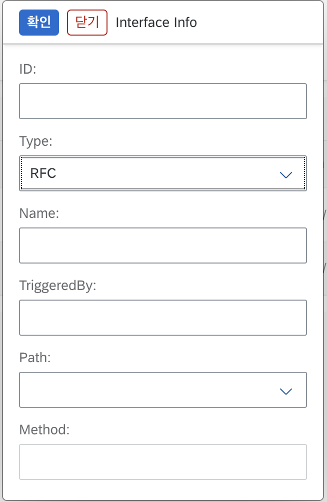
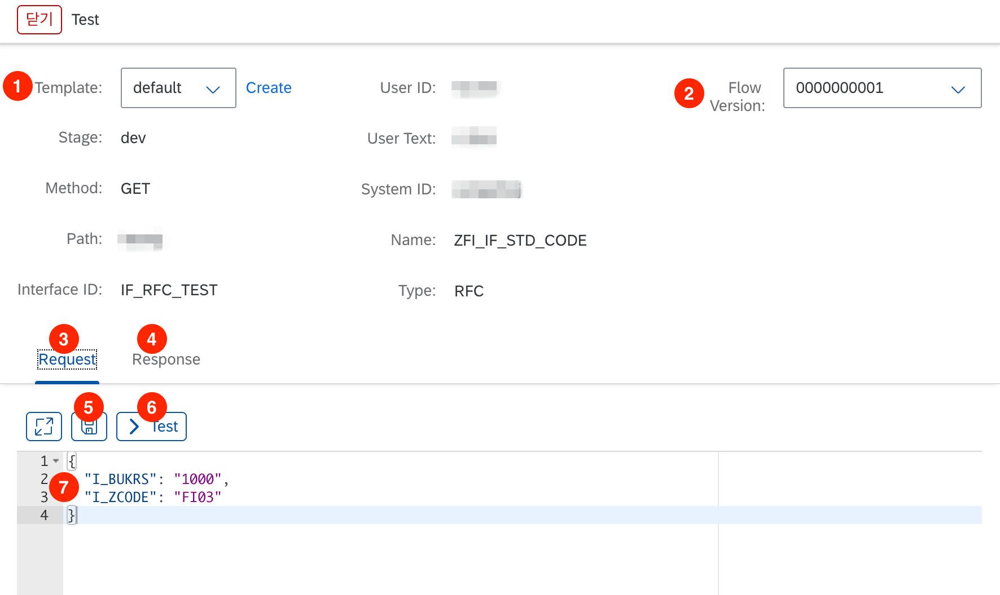

# Create Interface

## What is Interface?
Interface는 Flow를 실행하기 위해 필요한 매개체입니다. 사용자는 Interface를 생성하여 Flow를 실행할 수 있는 API를 만들 수 있습니다. 

> Interface를 생성하려면, 사전에 배포된 Endpoint가 필요합니다. [Endpoint 생성하기](/eai/functions/create_endpoint) 문서를 참조하세요.

각각의 Interface는 Flow의 `type`과 `Name`에 해당하는 Flow와 관련된 전반적인 정보를 가지고 있습니다. 이 정보는 사용자가 API를 통해서 호출할 때 `Function` 객체 안에 담긴 정보와 매칭됩니다. 이를 통해 해당 API 호출이 사용자가 정상적으로 의도한 Interface인지 검증합니다. 

## Interface 생성하기

Interface는 Flow와 N:1의 관계에 있습니다. Flow와의 관계가 종속적이기 때문에 Flow 페이지 내에서만 Interface를 생성할 수 있습니다.

1. "Flow List" 페이지에서 Interface를 생성하고자 하는 Flow를 선택합니다.
   
2. "Flow" 페이지 하단 테이블 탭에서 "Interface"❶를 선택합니다.
   
3. "Add"❷ 버튼을 클릭합니다.
4. Interface 정보를 입력합니다.
   
    |UI  |
Description
|
    |:---:|------------|
    |  |  <ul style="font-size: .8rem;"><li>**ID**는 사용자가 Infterface를 식별하기 위한 유니크한 값입니다.</li><li>**Type**은 "Flow-Step"에서 어떤 기능을 사용할지 명시적으로 보여주기 위한 값입니다.</li><li>**Name**은 Type이 RFC인 경우 "Function.name"의 역할을 DB인 경우에는 "TableName"의 역할을 합니다.</li><li>**TriggeredBy**는 Interface를 호출하는 SystemID 값입니다.</li><li>**Path**는 Endpoint의 Path 값입니다. 배포된 Endpoint 목록중 선택할 수 있습니다.</li><li>**Method**는 Endpoint의 Method 값입니다. Path 선택시 자동으로 입력됩니다.</li></ul>|  
    
5. "확인" 버튼을 클릭합니다.
   
## Interface 테스트해 보기

Interface를 성공적으로 만들었다면, 해당 Interface를 테스트해 볼 수 있습니다. 테스트시에는 `reqeust.body.Data` 객체에 해당하는 값만 설정하면 됩니다. 그 외 필요한 값은 자동으로 적용됩니다.

> 테스트전 Interface가 배포되었는지 확인하세요. 배포되지 않은 Interface 테스트 결과는 Error를 반환합니다. [Flow, Interface, Endpoint 배포](eai/functions/deploy) 문서를 참조하세요.

1. 테스트하려는 Interface의 "Test" 버튼을 클릭합니다.
    

      -  "Template"➊은 `request.body.Data` 값을 저장합니다. "Create" 버튼 클릭 후 Template의 이름을 지정하고 "저장"❺버튼을 클릭하면 하나의 Template을 만들 수 있습니다. 미리 정해진 데이터를 저장한 후, 테스트 상황별로 Template을 불러와 사용할 수 있습니다.
      -  "Flow Version"➋은 Interface에 연결된 Flow의 버전을 선택하여 테스트할 수 있습니다. 

2. "Request"➌ 탭의 "Codeeditor"➐ 공간에 `reqeust.body.Data` 값을 입력합니다.
3. "Test"➏ 버튼을 클릭합니다.
4. "Response"➍ 탭에서 결과를 확인합니다.