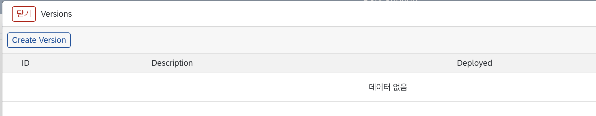
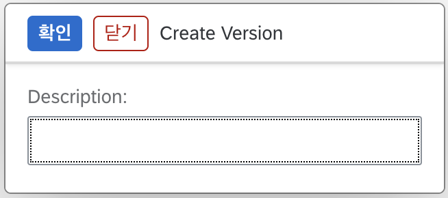
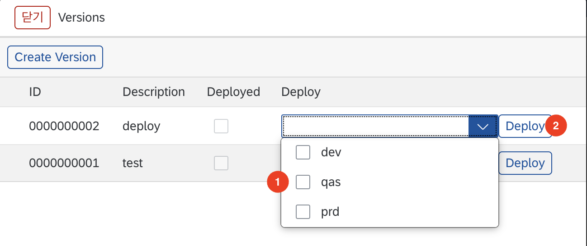
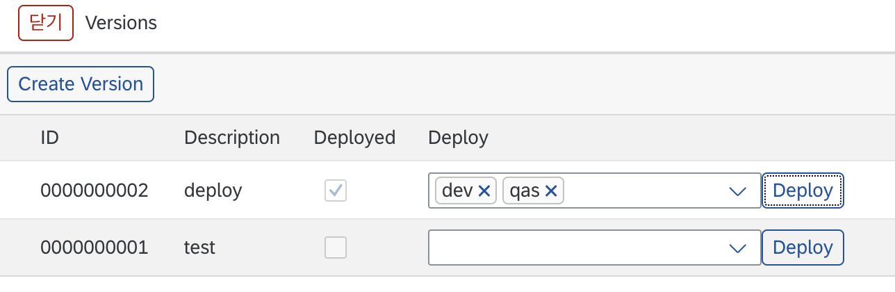

# Flow, Interface, Endpoint 배포

Flow, Interface, Endpoint는 생성 후 배포 작업을 완료해야 실제로 사용할 수 있습니다. 배포는 버전관리를 통해서 가능합니다. 현재 사용중인 contents를 무분별하게 변경하는 것을 방지하기 위해, 수정후 배포까지 완료되어야 contents가 정상적으로 변경됩니다.

## Version 생성
contents를 배포하기 위해서는 특정 시점의 정보가 담겨있는 버전이 필요합니다. 간략한 버전정보 입력과 클릭 몇번이면 손쉽게 버전을 생성할 수 있습니다. 

1. List 페이지나 상세화면에서 "Versions" 버튼을 클릭합니다.
2. "Create Version" 버튼을 클릭합니다.
   
3. 해당 Version의 간략한 정보를 "Description"에 입력합니다.
  
5. "확인" 버튼을 클릭합니다.

## Version 배포
생성된 Flow, Interface, Endpoint를 사용하기 위해서는 배포작업이 이루어져야 합니다. 배포는 현재 사용중인 시스템뿐만 아니라
다른 시스템에도 적용할 수 있습니다. 배포하고자 하는 시스템을 선택 후 "Deploy" 버튼만 클릭하면 됩니다.

1. Deploy 컬럼 "SelectBox"❶에서 배포하고자 하는 시스템을 선택합니다. 다중 선택이 가능합니다.
   
2. "Deploy"❷ 버튼을 클릭합니다. 
3. 정상적으로 완료시 "Deployed" 체크박스가 체크 상태로 변경됩니다.
   