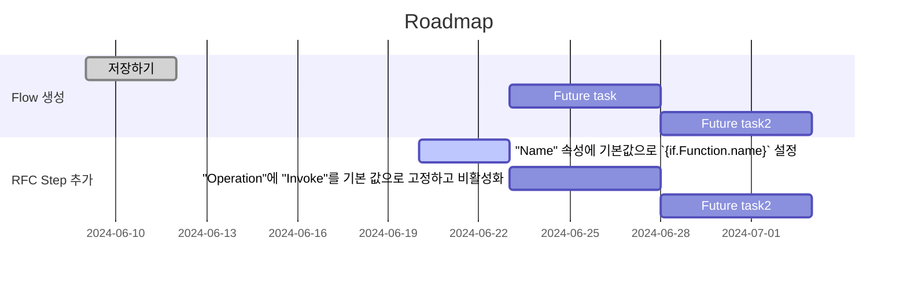

```mermaid
gantt
dateFormat  YYYY-MM-DD
title Roadmap
excludes weekdays
tickInterval 3day

section Flow 생성
저장하기:done,  des2, 2024-06-09, 3d
Future task               :des3, after des2, 5d
Future task2               :des4, after des3, 5d

section RFC Step 추가
"Name" 속성에 기본값으로 `{if.Function.name}` 설정:active,des2,2024-06-20, 3d
"Operation"에 "Invoke"를 기본 값으로 고정하고 비활성화:des3, after des2, 5d
Future task2               :des4, after des3, 5d
```
