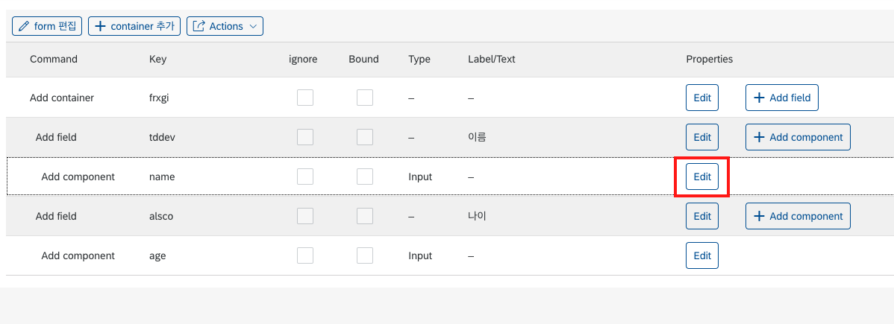
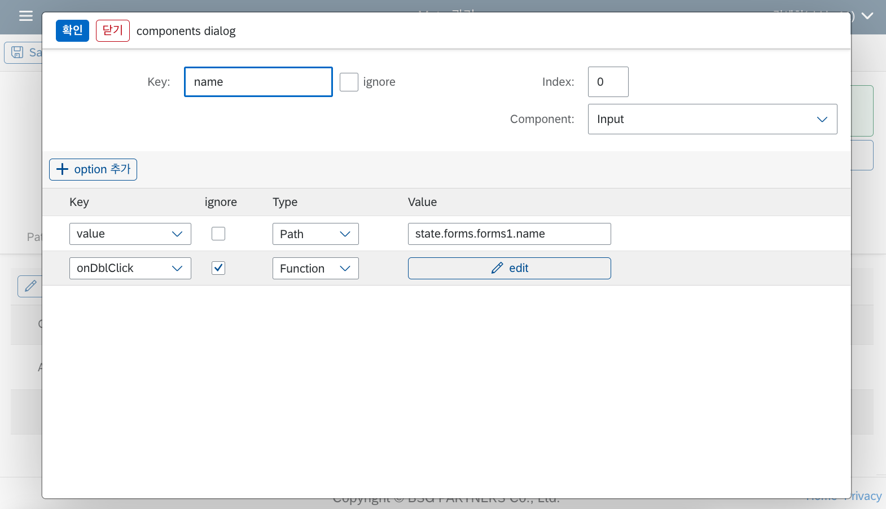
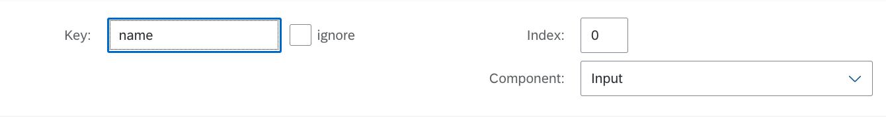
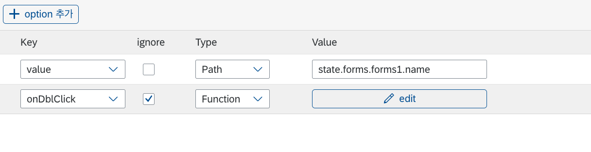

# Builder UI 세부사항

이번 장에서는 Builder 페이지의 UI를 통해 설정할 수 있는 각종 옵션 및 프로퍼티에 대한 세부 설명을 다루도록 하겠습니다.

## 맨 첫번째 위 table

## Form Edit

## Table Edit

## Header Edit

## Component Edit Dialog

LC5 빌더에서 컴포넌트를 추가하고 나면, `Edit` 버튼을 통해 컴포넌트의 상세 설정을 할 수 있는 다이얼로그에 접근할 수 있습니다.

다이얼로그의 상단부에는 컴포넌트에 관한 설정을 할 수 있는 폼이, 하단부에는 컴포넌트에 전달되는 속성(properties, 이하 컴포넌트 옵션)을 관리할 수 있는 테이블이 있습니다. 각 파트에 대해 간략하게 설명드리도록 하겠습니다.

### 상단부 폼

- Key : 컴포넌트 Key를 설정할 수 있는 필드입니다. 컴포넌트 Key의 쓰임에 대한 설명은 [Meta, State](/lc5/concepts/meta_state/#key-key)를 참고하세요.
- ignore : 생성한 컴포넌트를 삭제하고 싶을 경우 설정할 수 있는 속성입니다. ignore로 표시된 컴포넌트는 렌더러 페이지에서 표시되지 않습니다. 이는 기존 데이터를 유지하면서 렌더러에서는 없애고 싶을 때 유용합니다.
- Index : 부모 레이아웃에서 해당 컴포넌트의 등장 순서를 설정할 수 있는 속성입니다. 현재는 첫 번째로 표시되는 컴포넌트이기 때문에 0 값을 가지지만, 다른 값을 줄 경우 컴포넌트가 다른 순서로 배치됩니다.
- Component : 해당 컴포넌트의 타입을 결정할 수 있는 속성입니다. 컴포넌트 타입 리스트에 관해서는 미리 정의된 컴포넌트 문서의 [세부 컴포넌트 섹션](/lc5/concepts/prebuilt_components/#_3)을 참고하세요.

### 하단부 테이블

- Key : 컴포넌트 옵션 키입니다. 설정하고자 하는 옵션의 이름을 지정합니다.
  셀렉트 박스 오픈 시 지정한 컴포넌트 타입에 따라 추천 옵션이 주어집니다.
- ignore : 위에서 설명했던 ignore 속성과 동일합니다. 체크 시 해당 옵션은 적용되지 않습니다.
- Type : 컴포넌트 옵션 value를 할당하는 방법을 지정합니다. 모든 컴포넌트가 동일하며, **Array, Boolean, Function, Number, Path, String** 타입이 있습니다. 각 타입에 대한 구체적인 설명은 아래 섹션을 참고해 주세요.
- Value : 컴포넌트 옵션 value를 지정합니다. Type에서 어떤 방식을 선택했느냐에 따라 코드를 입력할 수도 있고, 단순 텍스트를 입력할 수도 있습니다.

### Option Type

옵션 타입은 컴포넌트 옵션에 값을 전달하는 방법을 정의하는 것과 같습니다. 각 타입에 대해 설명하자면 다음과 같습니다.

#### Array

#### Boolean, Number, String

각 이름에 해당하는 JavaScript 원시 데이터를 설정할 수 있는 타입입니다. 입력 시 따옴표를 추가할 필요는 없으며 지정할 데이터를 그대로 입력하면 됩니다.
기본적으로 설정한 값이 그대로 각 타입으로 변환되어 전달되지만, 데이터 바인딩을 사용하여 동적인 State 접근을 할 수도 있습니다. 데이터 바인딩에 대한 설명은 다음 섹션을 참고하세요.

#### Function

Function은 크게 두 가지로 구분됩니다.

1. **async Function** : onChange, onClick 등 이벤트 핸들러 이름을 Key로 할 경우 지정되는 함수 타입입니다. 여기서 작성한 함수는 옵션값에 함수 그 자체로 전달되어 부착됩니다.
2. **Function** : 이벤트 핸들러 옵션이 아닌 기타 옵션의 경우 일반 Function으로 지정됩니다. 여기서 지정한 함수는 컴포넌트 렌더링 시점에 실행되어 함수의 리턴값이 옵션값으로 전달됩니다.

async Function과 일반 Function의 구분은 코드 입력 에디터의 UI를 통해 확인할 수 있습니다.

  

  <figure>
  
  <figcaption style="color: gray; font-style:normal; margin: 0.5em auto;">일반 Function일 때의 코드 에디터 UI</figcaption>
  </figure>
  <figure>
  
  <figcaption style="color: gray; font-style:normal; margin: 0.5em auto;">async Function일 때의 코드 에디터</figcaption>
  </figure>
    

#### Path

[State](/lc5/concepts/meta_state/#state)의 경로를 따라 할당되는 값입니다. 예를 들어 위 예시처럼 `state.forms.forms1.name`으로 설정했을 경우, state 객체 안의 해당 경로에 해당하는 데이터가 value에 전달되게 됩니다.
