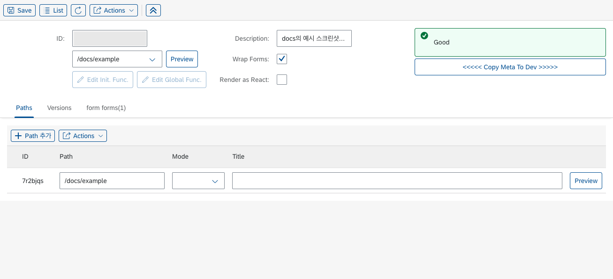
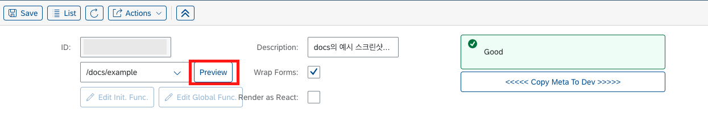

# Builder, Renderer

본 페이지에서는 LC5의 핵심 개념인 Builder, Renderer에 대해 다룹니다. 각 용어를 알지 않아도 LC5를 활용하는 데 큰 문제는 없지만, 알아둔다면 이후 등장할 LC5 사용법 문서를 쉽게 이해할 수 있을 것입니다.

> 본 페이지에서는 각 개념을 간략하게 살펴볼 것입니다. 구체적인 활용 방식에 대해서는 [Builder UI 레퍼런스](/lc5/reference/builder_ui)를 참고하세요.

## Builder

Builder는 사용자가 웹 서비스 UI를 생성하기 위해 활용하는 GUI 툴 페이지입니다.

사용자는 Builder 페이지에서 버튼 클릭만으로 다양한 레이아웃과 컴포넌트를 페이지 내에 배치할 수 있으며, 필요할 경우 JS 비즈니스 로직 코드를 작성할 수 있습니다.

Builder 페이지에서는 다음과 같은 일들을 수행할 수 있습니다.

- **레이아웃 컴포넌트 추가** : Builder 페이지의 상단에는 Form, Table, Dialog 등 주요 레이아웃 컴포넌트를 배치할 수 있는 버튼들이 있습니다. 이 버튼들을 클릭하면 해당 레이아웃이 페이지에 추가됩니다.
- **레이아웃 컴포넌트 수정** : 배치된 레이아웃은 Builder 페이지 하단부 테이블 패널에 탭으로 추가됩니다. 이 테이블은 각 레이아웃의 구조와 세부 정보를 보여줍니다. 각 레이아웃 탭 내에 있는 컴포넌트 편집 버튼을 통해 레이아웃 컴포넌트의 속성을 관리할 수 있습니다.
- **하위 컴포넌트 배치** : 컴포넌트 추가 버튼을 클릭하여 레이아웃 내에 하위 컴포넌트를 배치할 수 있습니다. 생성된 컴포넌트는 세부 속성을 정의하여 더욱 정교한 페이지를 구현할 수 있습니다.
- **경로 관리** : 테이블에 있는 Paths 탭을 통해 페이지 결과물이 실제로 링크될 url 경로를 설정할 수 있습니다. 경로는 여럿을 등록할 수 있으며, 이 경우 지정한 경로들에 Builder에서 생성한 동일한 UI 페이지가 렌더링됩니다.
- **버전 관리** : 테이블에 있는 Versions 탭을 통해 Builder 페이지의 버전을 관리할 수 있습니다. 이는 이미 배포된 사이트를 수정하거나, 이전에 생성해 둔 Builder 페이지 정보를 백업하면서 수정을 진행하고 싶을 때 유용합니다.

Builder 페이지의 각 UI에 대한 자세한 사용법을 알고 싶다면 [레퍼런스 페이지](/lc5/reference/builder_ui)를 참고하세요.

## Renderer

Renderer 페이지는 Builder 페이지에서 설계한 UI를 렌더링하는 페이지입니다.

Renderer 페이지에는 두 가지가 있습니다. 첫 번째는 사용자가 Builder 페이지에서 **Preview** 버튼을 클릭하여 접속할 수 있는 **Preview 페이지**입니다.

해당 페이지에서 사용자는 자신이 Builder에서 생성한 UI가 실제로 렌더링된 모습을 실시간으로 확인하고, 필요에 따라 수정할 수 있습니다. Preview 페이지를 활용하면 지정한 경로에 접속하지 않아도 쉽게 UI를 확인할 수 있어 편리하고 효율적인 개발이 가능합니다.

두 번재는 사용자가 Builder 페이지에서 지정한 url 경로로 접속했을 때 조회할 수 있는 실제 **View 페이지**입니다. 해당 페이지는 고객이 접하게 될 페이지와 같습니다.

## 요약

Builder와 Renderer 페이지는 LC5의 핵심 구성 요소로, 사용자가 직관적으로 웹 페이지를 설계하고, 실시간으로 그 결과를 확인할 수 있도록 돕습니다. 웹 프로젝트 생성 및 기타 작업이 이루어지는 페이지는 Builder 페이지이고, Builder를 통해 만든 웹 서비스에 접근할 수 있는 페이지가 Renderer 페이지입니다.
