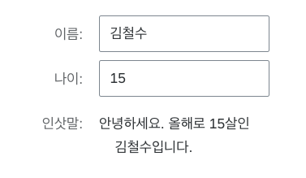
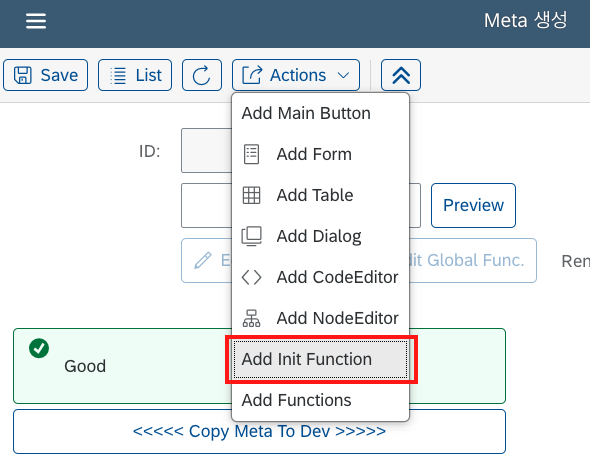
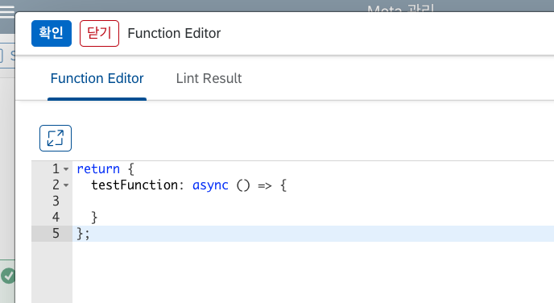

# 함수

LC5 Builder에서는 페이지에서 실행될 함수를 작성할 수 있으며, 페이지의 렌더링 사이클 및 컴포넌트 이벤트 핸들러에 커스텀 함수를 연결하여 호출하는 것이 가능합니다. 이를 통해 복잡한 비즈니스 로직을 연결하여 자유도 높은 웹 서비스를 개발할 수 있습니다.

LC5에서 함수를 구분하는 기준에는 여러 가지가 있습니다. 이번 장에서는 해당 기준들에 대해 살펴보며 함수가 LC5에서 어떻게 정의되는지 알아보겠습니다.

## 전달되는 방식에 따른 함수 분류

[Quick Start](/lc5/quickstart/#header) 페이지에서 봤듯이 LC5에서는 함수 타입을 컴포넌트의 옵션으로 전달할 수 있습니다. 하지만 옵션의 종류에 따라 그 값은 **사실 함수가 아닐 수도 있습니다**.

LC5에서는 **변수에 따라 동적으로 정해지는 값도 Function 타입을 통해 전달할 수 있습니다.** 함수 내에 정의된 로직을 실행하고, 그 결과값을 value에 반영하는 방식입니다. 따라서 이 두 가지 경우를 구별해야 합니다.

정리하자면, LC5에서 Function 에디터를 통해 전달할 수 있는 값에는 두 가지 종류가 있습니다. 첫 번째는 **함수 자체로 값이 전달되는 방식**이고, 두 번째는 **함수의 실행 결과가 값으로 반영되는 방식**입니다. LC5 내에서 첫 번째 함수는 **async function**, 두 번째 함수는 **non-async function**이라고 명명합니다. 각 함수에 대해 설명드리도록 하겠습니다.

### async Function

작성한 함수가 **함수 그 자체로 값에 전달**되어 부착되는 Function 타입입니다. 보통 직관적으로 생각하는 '함수 타입' 값이 LC5에서는 async Function에 해당합니다.

async Function 여부는 LC5 내의 시스템에 따라 자동으로 반영되며, 다음 경우들이 async Function에 해당됩니다.

1. **Add Init Function**을 통해 생성한 최초함수. 최초함수에 대해선 아래에서 설명할 것입니다.
2. **Key를 `onChange`, `onClick`과 같이 이벤트 핸들러 이름으로 붙인 Function Type 옵션**. 여기에는 `valueHelpV2-onConfirm`, `valueHelpV2-onRequest`와 같이 valueHelp 관련 이벤트 핸들러도 포함됩니다.

예시를 들어 보겠습니다. Input 타입 컴포넌트의 `onChange` 옵션으로 다음과 같은 함수 코드 로직을 설정하고 저장한다고 가정해 봅시다.

```
async () => {
  console.log("Hi!");
};
```

이 경우 async Function의 두 번째 조건에 해당되므로, Input의 onChange 프로퍼티에 지정한 함수가 그대로 전달되어 인풋값이 변경될 때마다 로그에 'Hi!'가 찍힐 것입니다.

async 함수의 경우, <span style="color: red;">**반드시 코드 로직 앞에 async 키워드를 붙여야 합니다.**</span> 즉, `async () => {}` 형태로 작성해야 합니다. async를 붙이지 않고 저장할 경우, 함수가 제대로 실행되지 않을 수 있습니다.

### non-async Function

작성한 함수가 컴포넌트 렌더링 시점에 실행되어 **함수의 리턴값이 옵션값으로 전달**되는 Function 타입입니다. 위에서 async Function의 조건에 해당하지 않는 모든 함수 옵션들은 non-async Function으로 처리됩니다.

예시를 들어 보겠습니다. [Quick Start](/lc5/quickstart) 페이지에서 만들었던 회원 명단 페이지에 non-async Function을 사용한 폼 컴포넌트를 하나 추가해 봅시다.

폼에 Text 타입 컴포넌트를 하나 추가하고, value 타입을 Function으로 지정한 뒤 다음과 같은 값을 넣고 저장하였습니다.

```
({ state }) => {
  if (
    !state.forms.forms1 ||
    !state.forms.forms1.age ||
    !state.forms.forms1.name
  ) {
    return "";
  }
  return `안녕하세요. 올해로 ${state.forms.forms1.age}살인
    ${state.forms.forms1.name}입니다.`;
};
```

Preview를 해봅시다. 어떻게 될 것 같나요? 폼의 끝부분에 이름 value와 나이 value를 받아서 동적으로 값을 계산하는 텍스트 컴포넌트가 추가되었습니다.



이렇듯 Function 함수는 동적으로 값을 계산하여 적용하고자 할 때 사용합니다. 즉, **값을 결정하는 과정에서 지정한 함수를 사용하는 것이지, 함수 자체가 값으로 전달되는 것은 아닙니다.**

### async Function과 non-async Function의 구분

특정 옵션의 타입을 Function으로 지정했을 때, 반영될 함수가 async 타입인지는 코드 에디터 UI를 통해 확인할 수 있습니다.

만약 async 키워드가 파라미터 앞에 붙어 있다면 해당 함수는 async 방식으로 반영된다는 의미입니다. async 키워드가 없다면, non-async Function으로 적용된다는 뜻입니다.

  <div style="display: flex; gap: 10px;">
  <figure>
  
  <figcaption style="color: gray; font-style:normal; margin: 0.5em auto;">non-async Function일 때의 코드 에디터 UI</figcaption>
  </figure>
  <figure>
  
  <figcaption style="color: gray; font-style:normal; margin: 0.5em auto;">async Function일 때의 코드 에디터</figcaption>
  </figure>
    </div>

async 키워드가 있을 땐 함수 코드 앞에서 async를 넣어야 한다는 사실을 잊지 마세요. 반대로 non-async Function의 경우 async를 붙이면 안 됩니다.

## 특별한 함수 타입

지금까지 우리는 전달되는 방식에 따라 함수 옵션을 async Function과 non-async Function으로 구분하였습니다. 이번에는 컴포넌트 혹은 레이아웃의 옵션으로 추가되지 않는 특별한 함수들을 소개하도록 하겠습니다.

### 최초 함수(Init Function)

최초 함수는 페이지가 처음 렌더링되는 시점에 딱 한 번만 실행되는 함수입니다. 주로 데이터 페칭 로직, state 세팅 코드 등이 들어가게 됩니다.

최초 함수를 추가하는 방법은 레이아웃 컴포넌트를 추가하는 것과 같이 빌더 페이지의 Actions 버튼을 누르고 **Add Init Function** 버튼을 누르면 됩니다. 이후에는 상단 폼에 있는 **Edit Init. Func.** 버튼이 활성화되며, 이 버튼을 통해 함수 코드에 접근 및 수정할 수 있습니다.



최초 함수는 함수 타입으로 실행되므로 async Function에 해당됩니다.

### 전역 함수(Global Function)

전역 함수는 중복되는 함수 코드 로직을 별도의 공간에 저장하고 재사용하기 위해 만들어진 함수 저장소입니다.

전역 함수를 추가하기 위해선 Actions 버튼에서 Add Init Function 밑에 있는 **Add Functions** 버튼을 누릅니다. 그러면 이러한 코드 편집창이 뜹니다.



전역 함수는 `{[키 값] : 함수}` 형식의 객체를 리턴합니다. 여기서 저장한 전역 함수들은 다른 함수 옵션에서 `fn` 파라미터를 통해 접근할 수 있습니다. 예시를 위해 최초 함수 안에서 전역 함수를 사용해 보겠습니다. 전역 함수에 아래와 같이 작성합니다.

```
return {
  testFunction: () => {
    console.log("Global function test");
  },
};
```

그리고 Init Function을 추가해서 아래와 같이 입력합니다.

```
async ({ fn }) => {
  fn.testFunction();
};
```

만들어둔 전역 함수는 `fn["지정한 키"]()` 방식으로 호출할 수 있습니다. 이제 Preview로 이동해서 testFunction이 잘 호출되었는지 확인합니다.


지정해둔 console.log 로직이 무사히 불러와져서 실행된 것을 확인할 수 있습니다.

Global Function 안에서 정의되는 함수는 async 함수와 non-async 함수 둘 다 가능합니다. async 함수를 등록하고 싶을 경우, 함수 앞에 async를 붙여 정의하면 됩니다.
