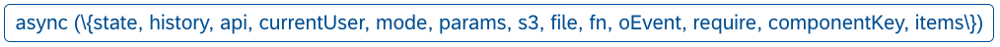

# 커스텀 함수

LC5 내에서는 페이지에서 실행될 함수를 작성할 수 있으며, 페이지의 렌더링 사이클 및 컴포넌트 이벤트 핸들러와 이를 연결하여 호출하는 것이 가능합니다.

이를 통해 복잡한 비즈니스 로직을 연결하여 자유도 높은 웹 서비스 개발이 가능합니다.

## 함수 타입

LC5에서 함수가 실행되는 시점에 따라 함수를 구분하면 크게 초기 함수, 컴포넌트 이벤트 함수 두 가지로 분류할 수 있습니다.

### 초기 함수(Init Function)

초기 함수는 페이지가 처음 렌더링되는 시기에 딱 한 번만 실행되는 함수입니다. 주로 데이터 페칭 로직, state 세팅 코드 등이 들어가게 됩니다.

### 컴포넌트 이벤트 함수(Function in Component)

컴포넌트의 지정된 이벤트 타입(onClick, onChange 등)에 연결되어 해당 이벤트 발생 시 호출되는 함수입니다.

각 컴포넌트마다 지원하는 이벤트 타입은 정해져 있으며, 해당 이벤트 속성을 키값으로 갖는 프로퍼티를 컴포넌트에 등록할 경우 함수 설정이 완료됩니다.

## 함수 파라미터

LC5 내에서 함수를 작성하고자 할 때, 원하는 비즈니스 로직을 작성하기 위해서는 해당 페이지의 상태값, 외부 모듈, 트리거된 이벤트 등에 대한 접근이 필수적일 것입니다. LC5에서는 자유도 높은 로직 작성을 위해 생성 중인 페이지와 연결되는 풍부한 파라미터를 제공합니다.

현재 지원 중인 파라미터 리스트는 다음과 같습니다.

다음은 각 파라미터에 대한 설명입니다.

### state

웹 페이지와 연동되는 상태값입니다. Builder를 통해 생성한 각 페이지는 각자 고유한 state값을 갖고 있습니다.
