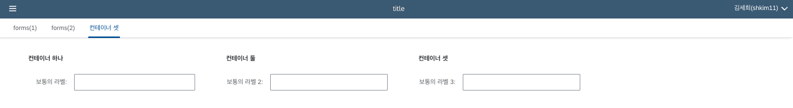
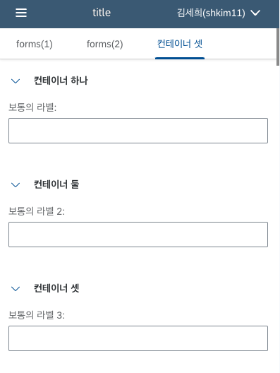

# LC5 기능 리스트

# 미리 정의된 컴포넌트 라이브러리

LC5는 크게 두 가지 컴포넌트 라이브러리를 미리 정의하여 사용하고 있습니다.

1. [OpenUI5](https://openui5.hana.ondemand.com/)의 sap.m 네임스페이스 컴포넌트
   
2. UI5 WebComponents를 리액트화한 [ui5-webcomponents-react](https://sap.github.io/ui5-webcomponents-react/?path=/docs/getting-started--docs)
   

두 라이브러리의 스타일은 기본적으로 유사하며 내부적으로 react 방식으로 돌아가는지, pure JS 방식으로 돌아가는지의 차이가 있습니다.
이외에 코드 에디터, 노드 기반 플로우 에디터 등 추가적인 컴포넌트는 서드파티 React 컴포넌트를 사용하고 있습니다.

# 미리보기

LC5를 통해 생성한 화면은 미리보기 버튼을 클릭하여 바로 생성된 UI 결과를 확인할 수 있습니다.

# 반응형 디자인 지원

LC5를 통해 생성된 화면은 반응형 디자인을 지원하여 별도의 설정 없이도 뷰포트의 크기에 따라 레이아웃의 너비와 구조가 알맞게 배치됩니다.

빌더 페이지에서 너비, 높이 등 CSS 속성을 수동으로 지정하여 적용하는 것도 가능합니다.

# 데이터 바인딩

LC5에서는 페이지에서 실행될 함수 로직을 직접 작성할 수 있으며, iHub와도 연동되어 있어 iHub에서 정의한 함수를 호출하는 것이 가능합니다.

# 템플릿 및 테마

LC5는 내부적으로 Form & Table 템플릿을 사용하여 폼, 테이블 등 메인이 되는 컴포넌트를 기반으로 구조적인 페이지 빌딩이 가능합니다.

또한 LC5는 UI5의 Fiori3, Horizon 테마를 지원하여 원하는 테마를 지정해서 쓸 수 있습니다.

# 버전 관리

LC5로 생성한 페이지는 버저닝을 지원하여 버전 히스토리를 통해 이전 작업 내역의 페이지를 저장할 수 있습니다. 또한 특정 버전을 직접 선택하여 배포하는 것이 가능합니다.

