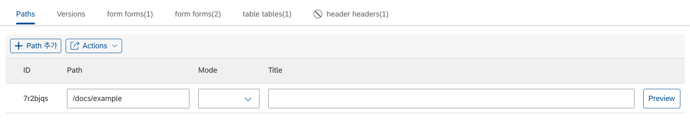
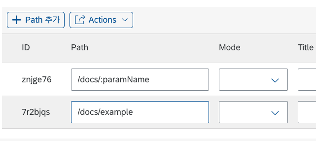

# 경로 및 버전 관리

LC5에서는 UI 생성 뿐 아니라 url 서빙 및 배포와 관련된 기능도 지원합니다. 경로 관리와 버전 관리는 그 기능들 중 하나입니다.

## 경로 관리

Builder 페이지의 Paths 테이블에서 해당 UI가 연결될 URL path를 설정할 수 있습니다. 경로를 지정하고 Meta를 저장하면, LC5가 적용된 도메인 밑의 해당 경로에서 생성한 서비스에 접근할 수 있습니다.

Path는 nested Path와 URL 파라미터를 지원합니다. URL 파라미터를 설정하고 싶을 경우 `/path/:paramName` 형식으로 Path를 지정합니다. 아래는 URL 파라미터를 설정한 예시입니다.

`:paramName` 위치에 파라미터 값을 넣어서 해당 path에 접근할 경우, [Function의 params 파라미터](/lc5/reference/function/#params)에서 이 값을 가져올 수 있습니다.

이외에도 Paths 테이블에서는 Mode와 각 Path에 대한 설명인 Title을 입력할 수 있습니다. Mode에 대한 설명은 [Function 페이지의 mode 파트](/lc5/reference/function/#mode)를 참고해 주세요.

## 버전 관리

LC5에서는 빌더를 통해 생성한 메타 데이터의 버전 생성 및 관리를 지원합니다. 또한 특정 버전을 직접 선택하여 배포하는 것이 가능합니다.

아무 버전도 생성하지 않은 LC5 프로젝트에서는 **Builder의 작업사항이 지정해둔 path에 실시간으로 반영**됩니다. 하지만 이는 프로덕션 환경에 이미 올려진 서비스를 수정해야 할 경우 변경 작업이 실시간으로 고객 화면에 반영되어 개발환경과 배포환경의 분리가 되지 않는다는 단점이 있습니다. 프로젝트 버전 관리는 이러한 상황을 처리하기 위해 만들어진 기능으로, 만약 Builder 내에서 새 버전을 생성하면 지금까지 만들어 둔 Meta 정보가 버전에 저장됩니다. 해당 버전을 Deploy하게 되면 **더 이상 path에서 실시간 Meta 데이터를 가져오지 않고, Deploy한 버전의 고정된 메타 데이터를 가져오게 됩니다.**

버전 관리는 Builder 페이지의 Versions 탭에서 할 수 있습니다. Versions 테이블 UI는 다음과 같습니다.

각 기능에 대해 설명하겠습니다.

1. Create Version : 현재까지의 메타 정보를 바탕으로 버전을 생성합니다.
2. Deploy : 선택한 버전으로 배포합니다. 이후에 path에서 렌더링하는 메타 데이터는 배포된 버전의 메타 데이터를 참조하게 됩니다.
3. Pre-Deploy : 시스템을 지정해서 배포할 수 있는 선택적 배포 기능입니다. Pre-Deploy를 할 경우 선택한 시스템에서는 해당 버전의 Meta를 가져오게 되고, 나머지 시스템에서는 최신 Meta를 불러오게 됩니다.
