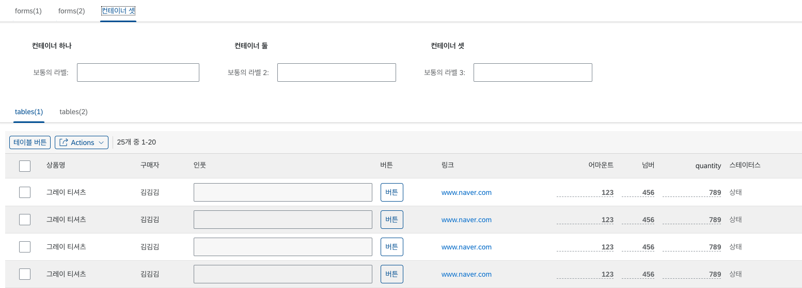
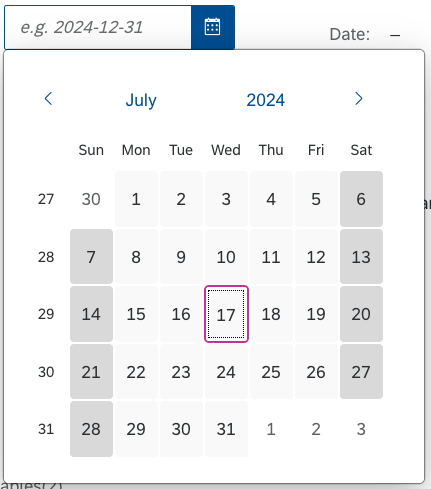
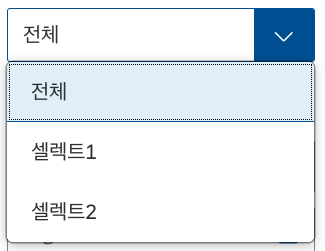

# 미리 정의된 컴포넌트

LC5는 기본적으로 SAP에서 제공하는 [UI5 컴포넌트](https://openui5.hana.ondemand.com/)를 사용하여 레이아웃을 구성하고 있습니다. UI5는 엔터프라이즈 표준을 준수하는 오픈소스 UI 컴포넌트 라이브러리로, 다양한 웹 애플리케이션에서 사용될 수 있는 풍부한 컴포넌트를 제공합니다. 이를 통해 LC5는 사용자가 직관적인 디자인의 웹 페이지를 손쉽게 제작할 수 있도록 지원합니다.

UI5 컴포넌트는 **반응형 디자인**을 지원하며, 이는 LC5에도 적용됩니다. 반응형 디자인이란 웹 페이지의 레이아웃이 뷰포트(viewport)의 크기에 따라 자동으로 조정되는 기능을 말합니다. 이를 통해 개발자는 별도의 설정 없이도 다양한 디바이스에서 일관된 사용자 경험을 제공할 수 있습니다. PC, 태블릿, 스마트폰 등 어떤 기기에서도 최적의 화면 배치를 제공함으로써, 사용자는 더 나은 접근성과 유연성을 누릴 수 있습니다.

## 컴포넌트 리스트

LC5에서는 Input, Radio, Button 등 폼에서 자주 쓰이는 컴포넌트를 미리 정의하여 제공하고 있으며, 개발자는 간단한 클릭만으로 컴포넌트를 가져와 사용할 수 있습니다. 제공되는 컴포넌트 리스트는 다음과 같습니다.

다음은 각 컴포넌트에 대한 설명입니다.

### Amount, Quantity

금액 및 수량 입력을 위한 필드를 제공합니다. 사용자 지정 단위와 콤마(,) 형식을 지원하여 사용자가 숫자 데이터를 정확하게 입력할 수 있습니다.

### Button

다양한 기능을 수행할 수 있는 버튼을 제공합니다. 클릭 이벤트를 쉽게 연결할 수 있어 사용자 인터랙션을 원활하게 할 수 있습니다.

### Checkbox

사용자가 하나 이상의 선택 항목을 선택할 수 있도록 하는 체크박스를 제공합니다. 다중 선택이 필요한 경우 유용합니다.

### CodeEditor

코드 편집 기능을 제공하는 에디터로, 문법 자동완성 및 코드 하이라이팅 기능을 지원합니다. 프로젝트 안에 코드 블럭 UI를 추가할 필요가 있을 경우 유용합니다.

### ComboBox

사용자가 목록에서 항목을 선택하거나 직접 입력할 수 있는 콤보 박스를 제공합니다. 선택 항목과 입력 필드가 결합된 형태입니다.

### Date

사용자가 날짜를 선택할 수 있는 인터페이스를 제공합니다. 캘린더 형태로 구현되어 있어 날짜 선택이 용이합니다.

### DateRange

시작일과 종료일을 선택할 수 있는 날짜 범위 선택 기능을 제공합니다. 프로젝트 기간 설정 등 다양한 시나리오에 활용할 수 있습니다.

### Input

사용자가 텍스트를 입력할 수 있는 필드를 제공합니다. 다양한 속성 설정을 통해 입력 형식을 제한하거나, 초기값을 설정할 수 있습니다.

### Link

사용자가 클릭하여 다른 페이지나 리소스로 이동할 수 있는 하이퍼링크를 제공합니다. 링크 텍스트와 URL을 설정할 수 있습니다.

### Number

숫자 입력을 위한 필드를 제공합니다. 공란일 경우의 표시 방식, 정렬, 단위 등의 설정을 추가할 수 있습니다.

### Radio

여러 선택지 중 하나를 선택할 수 있는 라디오 버튼을 제공합니다. 그룹으로 묶어서 사용하면 선택 항목 간의 배타성을 유지할 수 있습니다.

### ScannerButton

바코드 스캔 기능을 제공하는 버튼으로, 스캔한 데이터를 입력 필드에 자동으로 반영할 수 있습니다.

### Select

드롭다운 목록에서 하나의 항목을 선택할 수 있도록 하는 셀렉트 박스를 제공합니다. 많은 옵션을 간결하게 제공할 때 유용합니다.

### Status

항목의 상태를 시각적으로 표시하는 컴포넌트로, 미리 정의된 색상을 통해 상태를 구분할 수 있습니다.

### Text

고정된 텍스트를 표시하는 컴포넌트로, 설명이나 안내 문구 등을 표시할 때 사용합니다.

### TextArea

사용자가 여러 줄의 텍스트를 입력할 수 있는 필드를 제공합니다. 긴 텍스트 입력이 필요한 경우 유용합니다.

### Uploader

파일 업로드 기능을 제공하는 컴포넌트로, Browse 버튼이나 빈칸 필드를 클릭 시 파일 탐색기가 열려 업로드할 파일을 지정할 수 있습니다.

---

이 외에도 LC5는 다양한 UI 컴포넌트를 지속적으로 업데이트하고 추가하고 있습니다. 이를 통해 사용자들은 최신 UI 트렌드를 반영한 웹 페이지를 손쉽게 제작할 수 있습니다.

LC5는 직관적인 사용자 인터페이스와 강력한 기능을 통해, 개발자들이 손쉽게 웹 페이지를 제작하고 비즈니스 로직 코드에 집중할 수 있도록 도와줍니다. 개발자들은 미리 정의된 컴포넌트를 활용하여, 보다 빠르고 효율적으로 원하는 웹 페이지를 구성할 수 있습니다.
