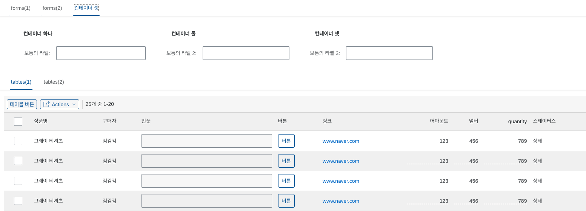

# LC5 기능 리스트

# 미리 정의된 컴포넌트 라이브러리

LC5는 크게 두 가지 컴포넌트 라이브러리를 미리 정의하여 사용하고 있습니다.

1. [OpenUI5](https://openui5.hana.ondemand.com/)의 sap.m 네임스페이스 컴포넌트
   
2. UI5 WebComponents를 리액트화한 [ui5-webcomponents-react](https://sap.github.io/ui5-webcomponents-react/?path=/docs/getting-started--docs)
   

두 라이브러리의 스타일은 기본적으로 유사하며 내부적으로 react 방식으로 돌아가는지, pure JS 방식으로 돌아가는지의 차이가 있습니다.

이외에 코드 에디터, 노드 기반 플로우 에디터 등 추가적인 컴포넌트는 서드파티 React 컴포넌트를 사용하고 있습니다.
