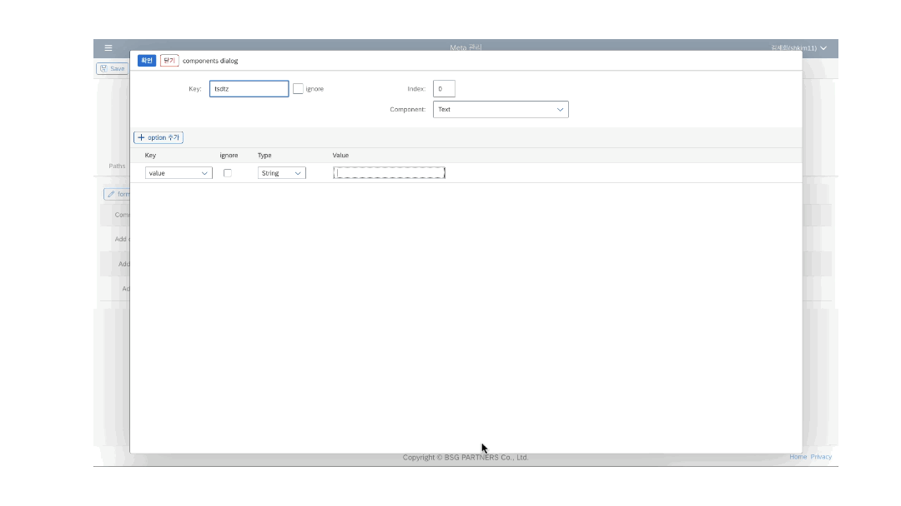

# LC5 Overview

## What is LC5?

LC5는 최소한의 코드로 쉽고 빠르게 고품질의 웹 페이지를 구현할 수 있도록 설계된 로코드(Low-Code) 도구입니다. 직관적인 사용자 인터페이스를 통해 다양한 웹 요소를 손쉽게 구현할 수 있으며, 반복적이고 단순한 UI 코드를 생략하면서도 비즈니스 로직을 자유롭게 추가할 수 있어 유연한 웹 페이지를 만들 수 있습니다.

## Why Low-Code?

로코드(Low-Code) 플랫폼은 소프트웨어 개발의 복잡성을 줄이고, 더 많은 사람들이 소프트웨어 개발에 참여할 수 있도록 합니다. 전통적인 코딩 방식과 달리, 로코드 플랫폼은 그래픽 사용자 인터페이스(GUI)를 사용하여 애플리케이션을 설계하고 개발할 수 있게 합니다. 이를 통해 코딩 경험이 없는 사용자도 자신의 아이디어를 신속하게 구현할 수 있습니다. 특히, 기업 환경에서는 빠르게 변화하는 시장 요구에 대응하고, 개발 비용을 절감하며, 개발 주기를 단축할 수 있는 중요한 도구가 됩니다. LC5는 이러한 로코드의 장점을 극대화하여 사용자들이 쉽게 웹 페이지를 제작하고 관리할 수 있도록 돕습니다.

## No-Code vs. Low-Code

노코드(No-Code) 툴은 코딩 지식이 전혀 없는 사용자도 손쉽게 애플리케이션을 개발할 수 있게 해줍니다. 그러나 이러한 툴은 커스터마이징에 제약이 있어 복잡한 기능을 구현하거나 특정 요구 사항을 반영하기 어려울 수 있습니다. 반면, 로코드 툴인 LC5는 최소한의 코드로도 풍부하고 복잡한 기능을 구현할 수 있습니다. 사용자는 필요한 경우 JavaScript 함수를 추가하여 커스터마이징할 수 있으며, 이를 통해 노코드 툴보다 더욱 유연하고 강력한 애플리케이션을 개발할 수 있습니다.

## 주요 특징

### 1. 폼 및 테이블 UI 기반의 페이지 구성

폼(Form)과 테이블(Table) UI를 기반으로 페이지를 쉽게 설계할 수 있습니다. 사용자는 직관적인 인터페이스를 통해 복잡한 코딩 없이도 웹 페이지를 구축할 수 있습니다.

### 2. 이벤트 핸들러 및 JavaScript 함수 등록

단순한 UI 구성 외에도, 이벤트 핸들러를 설정하고 JavaScript 함수를 등록하여 동적인 웹 페이지를 만들 수 있습니다. 이를 통해 사용자는 더욱 상호작용적이고 사용자 친화적인 웹 페이지를 구현할 수 있습니다.

### 3. 다양한 UI 요소 제공

LC5는 폼, 테이블, 모달 창, 코드 에디터 등 다양한 UI 요소를 제공합니다. 사용자는 GUI 환경에서 이들 요소를 손쉽게 배치하고 조정할 수 있습니다.

### 4. 편리한 배포 관리

Builder 페이지에서 연결될 경로(path)와 배포할 버전을 선택하여 관리할 수 있습니다. 이는 사용자가 복잡한 배포 과정을 간소화하고, 필요한 버전을 신속하게 배포할 수 있도록 돕습니다.

## More Info

LC5의 메인 컨셉을 더 살펴보려면 아래 링크를 참고하세요.

- [Builder, Meta, Renderer](concepts/builder_renderer.md)
- [미리 정의된 컴포넌트](concepts/prebuilt_components.md)
- [반응형 디자인 지원](concepts/responsive.md)
- [데이터 바인딩](concepts/binding.md)
- [템플릿 및 테마](concepts/templates.md)
- [버전 관리](concepts/versioning.md)
