# Quick Start

이 페이지에서는 LC5를 통해 간단한 폼-테이블 구조의 회원 명단 페이지를 만드는 방법을 배울 것입니다. 보다 세부적인 정보와 컨셉을 원한다면 concepts 섹션의 문서들을 참고해 주세요.

## 새 프로젝트 생성하기

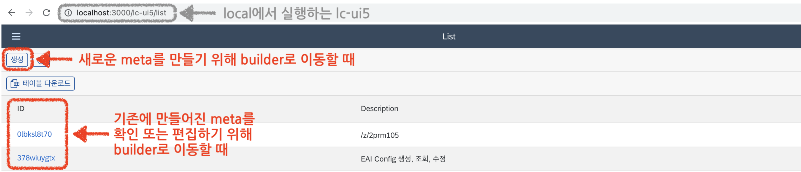

LC5에 처음 접속하면 list 페이지에 리다이렉트됩니다. 이 페이지는 기존에 생성된 프로젝트를 확인 또는 편집하거나 새로운 프로젝트를 생성하기 위한 페이지입니다. 우리는 새 프로젝트를 생성해 보겠습니다. 상단의 생성 버튼을 클릭하세요.

## 프로젝트 편집하기

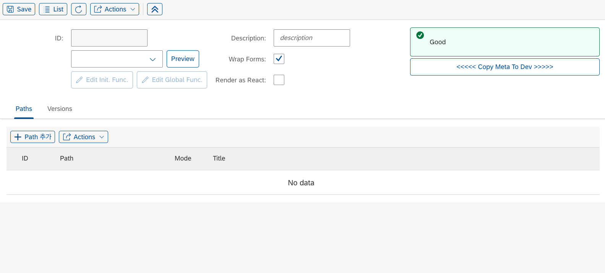

이제 우리는 생성된 빌더 페이지의 Meta 편집 창에 왔습니다. Meta란 간단히 말해 우리가 LC5를 통해 생성할 페이지의 UI 정보를 담고 있는 데이터이고, 빌더 페이지란 Meta를 GUI로 편집하고 저장할 수 있는 LC5 툴 페이지입니다. Meta에 대해 자세히 알고 싶으면 [Meta, State 페이지](/lc5/concepts/meta_state)를, 빌더 페이지에 대해 자세히 알고 싶으면 [Builder, Renderer 페이지](/lc5/concepts/builder_renderer)를 확인하세요. 우선 첫번째로 우리는 Meta의 ID를 지정해야 합니다. 좌측 상단의 **Save** 버튼을 누르세요.

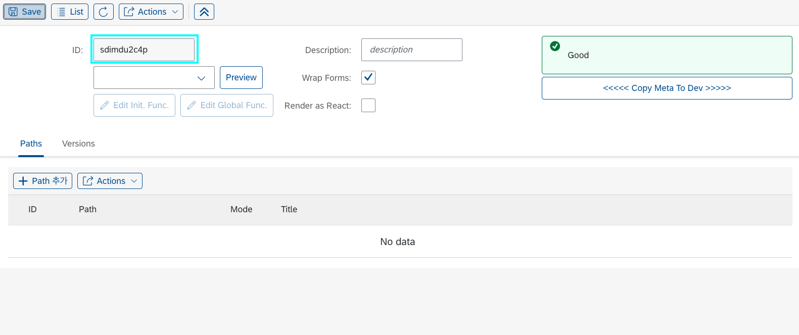

Save 버튼을 누르니 ID가 생성되었습니다. ID는 Meta를 구분하기 위한 고유한 아이디 값으로 자동 배정되며 수정할 수 없습니다.

### Path 생성

그럼 이제 UI를 추가하면 될까요? 하지만 그 전에 먼저 해야 할 일이 있습니다. 바로 **Path 추가**입니다. Path는 새 프로젝트와 연결될 url 경로입니다. 하단의 Paths 테이블 안에 있는 Path 추가 버튼을 클릭하세요.

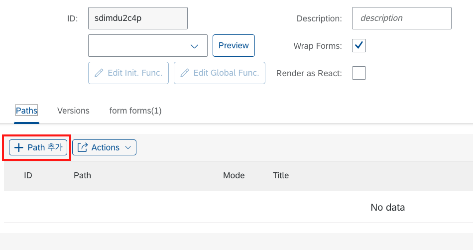

path 추가 버튼을 누르면, 테이블에 빈 input들로 이루어진 행이 추가된 것을 볼 수 있습니다. 이 테이블에 추가된 path 정보들을 통해 우리는 새로운 프로젝트에 접근하게 될 것입니다. Path 컬럼에 원하는 path 세그먼트를 입력해 주세요. 단, path 값은 <span style="color:red">**백슬래시(/)로 시작하는 영문 혹은 숫자로 된 문자열**</span>이어야 함에 유의하세요. 저는 /quickstart로 입력하겠습니다.

입력 후 좌측 상단의 **Save** 버튼을 눌러주세요.


입력한 값이 위의 이미지와 같이 ID의 아래 칸에 나타났다면, 성공입니다.

path를 UI보다 먼저 추가하는 이유는 path가 지정되어야 UI Preview 기능을 활용할 수 있기 때문입니다. Preview가 무엇인지는 아래에서 마저 다루겠습니다.

### Form 생성

그럼 먼저 폼을 추가해 보겠습니다. 상단에 **Actions** 메뉴를 열고 **Add Form**을 클릭해 주세요.

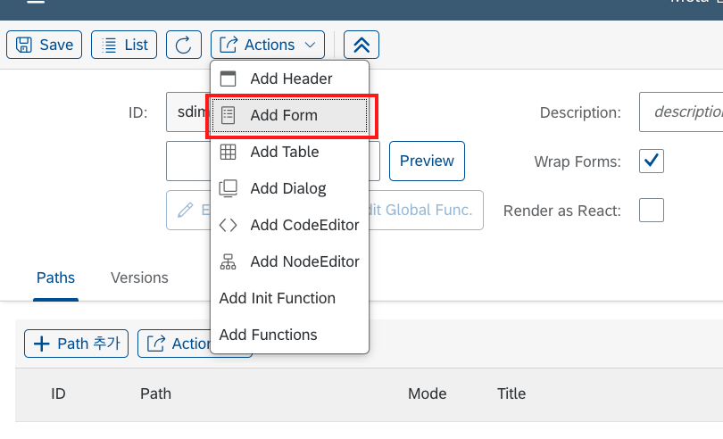
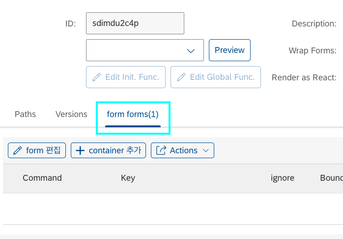

하단 테이블 패널에 폼이 추가된 게 보이시나요? 간단한 클릭으로 우리는 프로젝트에 폼을 추가했습니다. 어디 한 번 생성된 결과 UI를 미리 봐 보도록 하겠습니다. 먼저 Save를 누르고, 상단의 Preview 버튼을 눌러보세요.

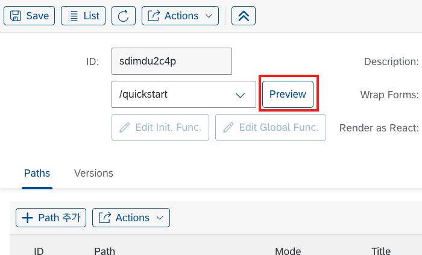

preview 버튼을 누르면, 웹 사이트의 url이 `preview/[지정한 path값]`으로 이동된 것을 확인하실 수 있습니다. 이렇듯 Preview는 지금까지 만들어둔 UI를 미리 확인할 수 있는 사이트로 이동시켜주는 기능입니다. 하지만 preview 사이트에는 비어있는 페이지가 있을 것입니다. 이는 우리가 Form 레이아웃만 생성하고, **내부의 컴포넌트는 하나도 채우지 않았기 때문입니다.**

그럼 Form을 한 번 채워 보겠습니다. 이전 페이지로 돌아가서 테이블 패널의 생성해둔 form 탭을 클릭하고, **container 추가** 버튼을 눌러보세요.

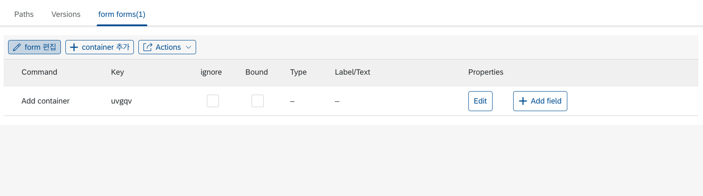

테이블에 컨테이너가 추가되었습니다! 컨테이너란 Form 레이아웃의 **가로축 방향으로 쌓이는** 하위 레이아웃 단위입니다. 만약 컨테이너를 하나 더 생성하면 폼은 가로로 이등분된 두 개의 섹션을 가지게 될 것입니다.

우선은 하나의 컨테이너로 진행하겠습니다. 생성한 컨테이너 행에 있는 **Add field** 버튼을 눌러주세요.

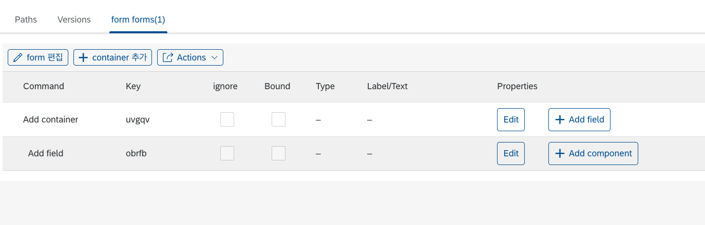

컨테이너에 필드가 추가되었습니다! 필드는 컨테이너에 **세로축 방향으로 쌓이는** 하위 레이아웃 단위입니다. 만약 한 필드에 컴포넌트를 10개 추가하면, 모든 컴포넌트는 하나의 행에 쌓이게 됩니다. 그러니 필드를 적절히 추가하며 컴포넌트를 추가해 주는 것이 중요합니다.

그럼 이제 UI에 처음으로 보이게 될 컴포넌트를 추가해 보겠습니다. **Add Component** 버튼을 눌러 주세요.

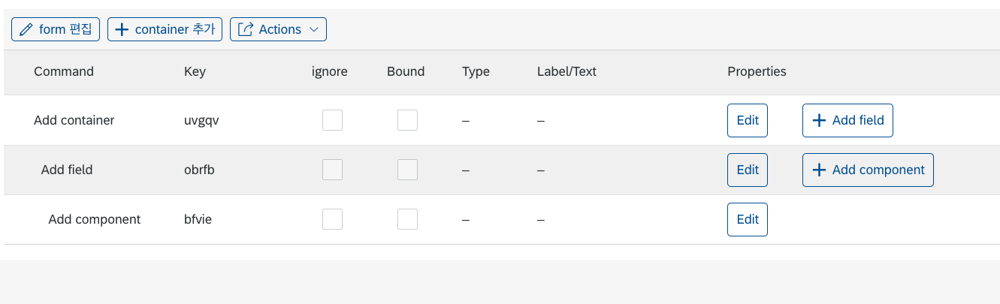

컴포넌트까지 무사히 추가되었습니다. 이제 컴포넌트를 자세히 커스텀해 봅시다. 마지막으로 추가한 컴포넌트 행에 있는 Edit 버튼을 눌러보세요.

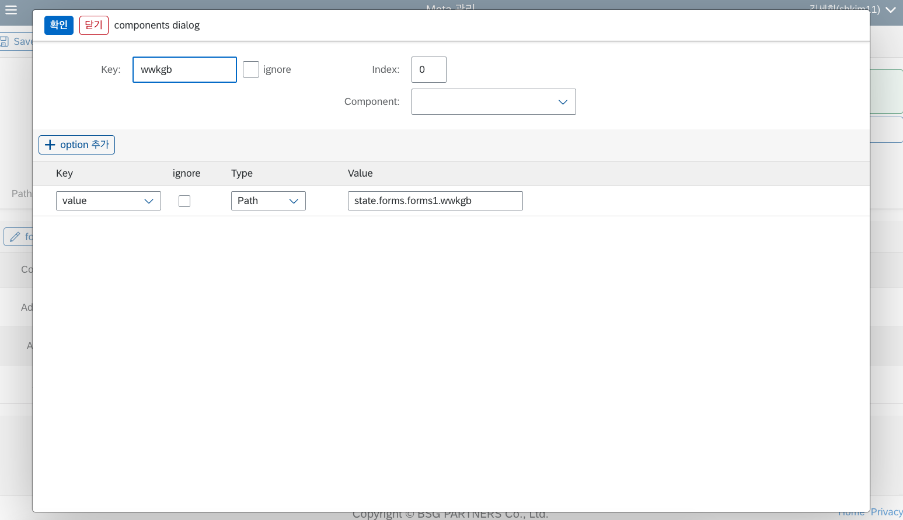

컴포넌트 설정을 할 수 있는 편집 다이얼로그가 나타났습니다. 많은 필드들이 있지만, 우선은 필요한 요소만 설정하도록 하겠습니다. 각 필드들의 자세한 설명은 [Builder UI](/lc5/reference/builder_ui/#_3) 페이지를 참고하세요.

먼저 상단 폼에서 Component를 클릭해서 Input을 선택해 주세요. 그런 다음, Key 값을 name으로 설정하도록 하겠습니다. 완성된 모습은 다음과 같습니다.

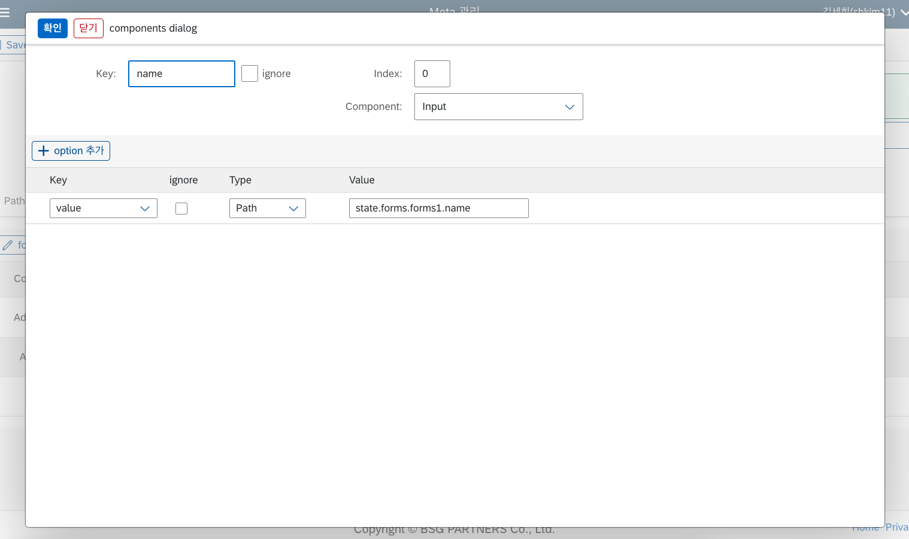

좌측 상단 확인 버튼을 누르고, Save 해주세요. 그리고 Preview를 눌러 보세요.

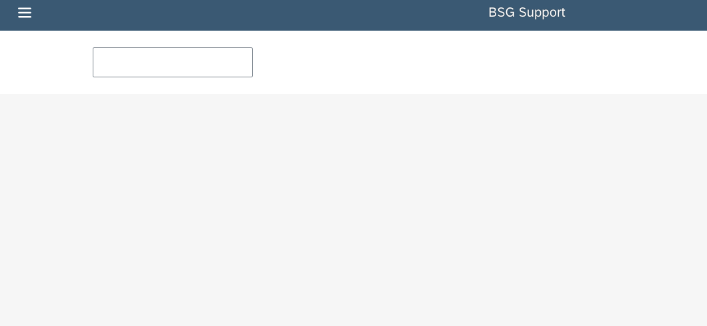

드디어 화면에 무언가 나타났습니다. 하지만 여전히 너무 허전합니다. 무엇보다 라벨이 없으니 어떤 Input인지 알 수가 없습니다.

다시 이전 페이지로 돌아가서 라벨을 추가해 보겠습니다. 이번엔 Field 행에 있는 Edit 버튼을 눌러 보세요.

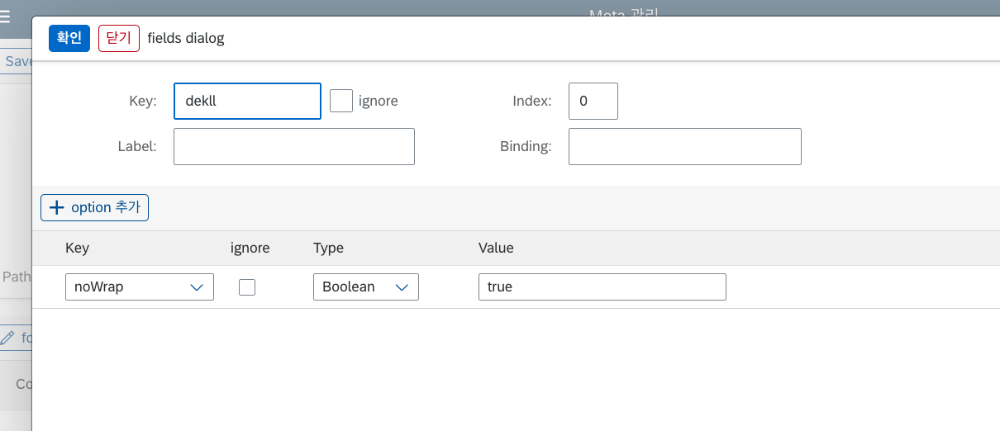

상단 폼에 Label input이 나타났습니다. Label에 **이름**을 입력하고 확인, Save, Preview를 눌러 봅시다.

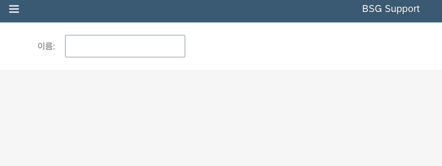

드디어 제대로 된 폼이 나타났습니다! 이제 우리는 LC5로 폼을 만드는 법을 배웠습니다.

폼에 회원 명단에 필요한 다른 필드를 추가해서 저장해 보세요. Input 말고 다른 컴포넌트를 추가해도 좋습니다. 저는 이렇게 만들었습니다.

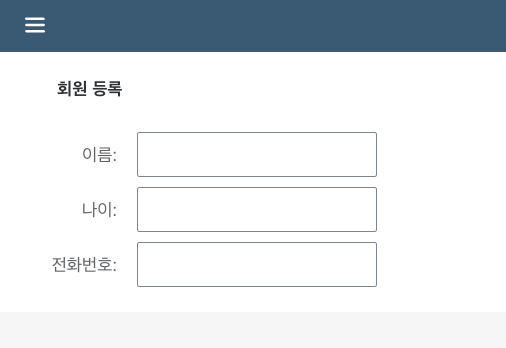

컨테이너 title도 지정해 주었습니다.

### Table 생성

이제 폼 아래에 회원 리스트 테이블을 만들어 봅시다. 폼을 만들 때와 마찬가지로 Actions 버튼을 눌러서 Add Table 버튼을 클릭합니다.

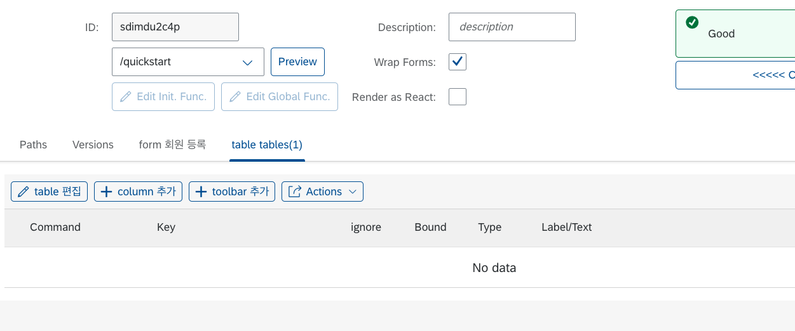

테이블 편집 패널은 폼과 조금 다르지만, 거의 유사합니다. 폼의 container라는 것이 테이블엔 없고, 폼의 field 대신 column이 있습니다. 컬럼은 우리가 아는 바로 그 테이블의 열을 말합니다. 테이블 컬럼을 하나 추가하면, 폼의 field와 마찬가지로 Add Component 버튼이 생깁니다. 이를 통해 각 컬럼에 렌더링될 컴포넌트를 지정할 수 있습니다.

우선 우리는 회원 등록 폼에서 만들었던 필드와 같은 key들을 가진 테이블 컬럼들을 설정해 주겠습니다. 이렇게 일치하는 key를 설정하지 않으면, 나중에 일일이 데이터를 맞춰줘야 하므로 골치아파질 것입니다. 완성된 테이블의 Builder View는 다음과 같습니다.

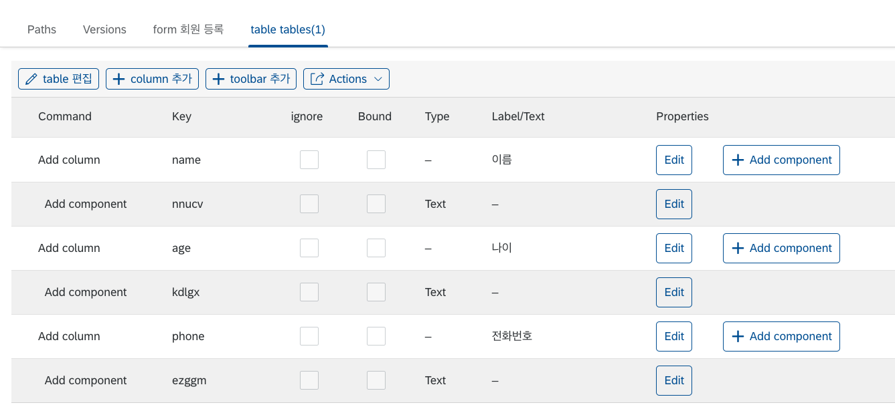

이렇게 만들고 저장 후 Preview를 해봅시다.

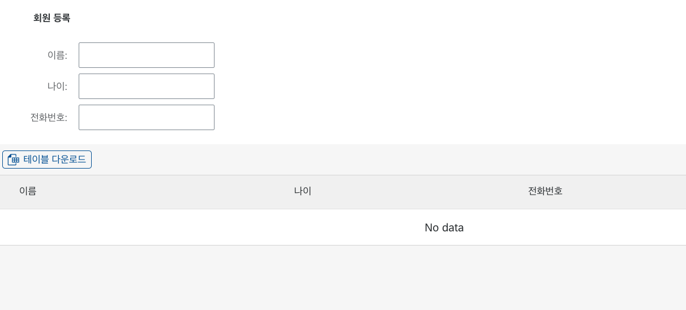

폼 아래에 테이블이 생겼습니다! 하지만 아직 아무런 데이터가 없어 비어 있습니다.

### Header 생성

이제 폼에서 데이터를 입력하고 저장을 누르면, 테이블에 하나씩 쌓이는 구현을 해 보겠습니다. 다시 빌더 페이지로 돌아가서, 이번엔 Actions의 Add Header를 눌러주세요.

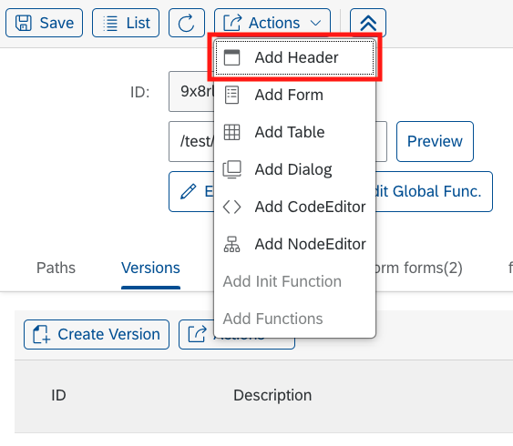

누르면 하단 테이블 패널에 header 탭이 추가된 것을 볼 수 있습니다.

Header는 여러 버튼들을 추가할 수 있는, 웹페이지 최상단의 레이아웃입니다. 헤더 탭을 클릭하고 button 추가 버튼을 클릭하세요. 버튼이 생기면 Properties 컬럼의 Edit 버튼을 눌러 봅시다.

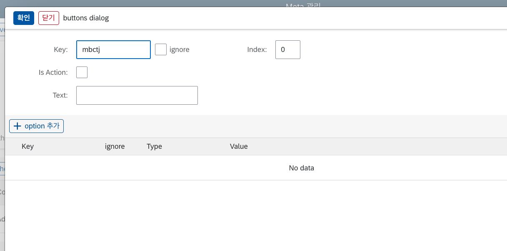

버튼 속성 편집창입니다. 이제 꽤 익숙해졌을 것입니다. Text 란에 **저장** 텍스트를 입력하고, option 추가를 눌러 보세요.

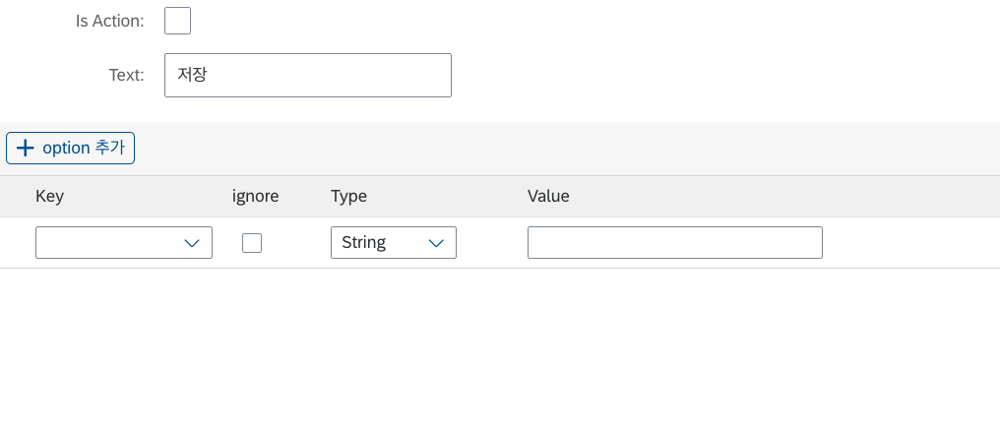

여기서 중요합니다. 우리는 버튼을 누를 때 폼의 내용이 저장되는 로직을 만들어낼 것입니다. 생성된 option의 Key를 **onPress**로 입력하고, Type를 **Function**으로 지정하세요. 그런 다음 Value 쪽에 생긴 edit 버튼을 누르세요.

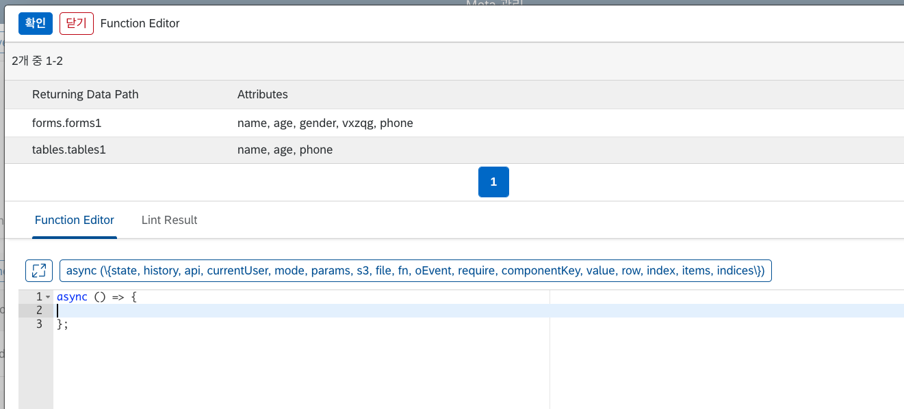

커스텀 함수를 연결할 수 있는 Function Editor에 입장했습니다. 상단에 있는 테이블은 현재 접근 가능한 State path입니다. (일부 우리 폼에 맞지 않는 attributes는 무시하세요, 제가 잘못 넣었습니다.) 이제 우리는 이 정보를 바탕으로 Form State에 있는 데이터를 Table State로 옮기는 작업을 할 것입니다. 우선은 아래와 같이 입력하세요.

```
async () => {
  return (draft) => {
    draft.tables.tables1 = [
      ...(draft.tables.tables1 || []),
      draft.forms.forms1,
    ];
    draft.forms.forms1 = {};
  };
};
```

Function에 대한 자세한 설명은 [함수](/lc5/concepts/function) 페이지를 참고하세요. 또 State path의 구조에 대해 궁금하다면 [Meta, State](/lc5/concepts/meta_state/#state_1) 페이지를 참고하세요.

상단의 확인 버튼을 누르고, 저장 후 Preview를 해보세요. 그리고 폼을 채운 후 방금 생성한 저장 버튼을 눌러 보세요.

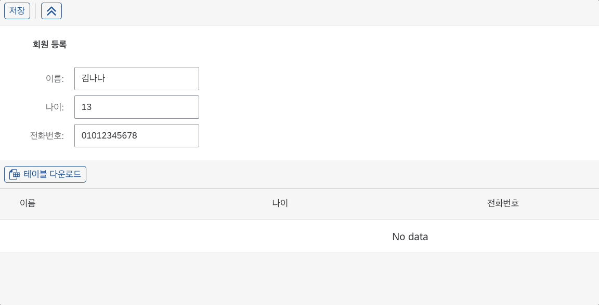

폼의 내용이 테이블로 저장되었습니다! 🥳 회원 명단 페이지가 몇 번의 클릭과 입력으로 간단하게 구현되었습니다.

본 예제에서는 간단한 코드 샘플을 위해 State를 활용하여 폼 전송을 구현했지만, 실제 LC5에서는 S3와 연결하여 지속 가능한 저장소에 데이터를 넣을 수 있는 모듈이 내장되어 있습니다. 또한, BSG Support에서는 Lambda, DynamoDB 등 AWS의 수많은 서비스들과 연동되어 복잡한 비즈니스 로직을 설계할 수 있는 서비스인 **API-Hub**(이하 IHub)를 제공합니다. LC5에 IHub를 연동해서 사용한다면, 여러 서비스를 아우르는 복잡한 로직을 LC5에 간단하게 붙일 수 있습니다. 그러므로 LC5를 통해 개발하고 있는 프로젝트의 복잡성이 올라간다면, IHub 연동을 추천드립니다.

좀 더 심화적인 프로젝트 구성을 원한다면 concepts 페이지를 둘러보시고 LC5로 어디까지 만들 수 있는지 시험해 보세요!
