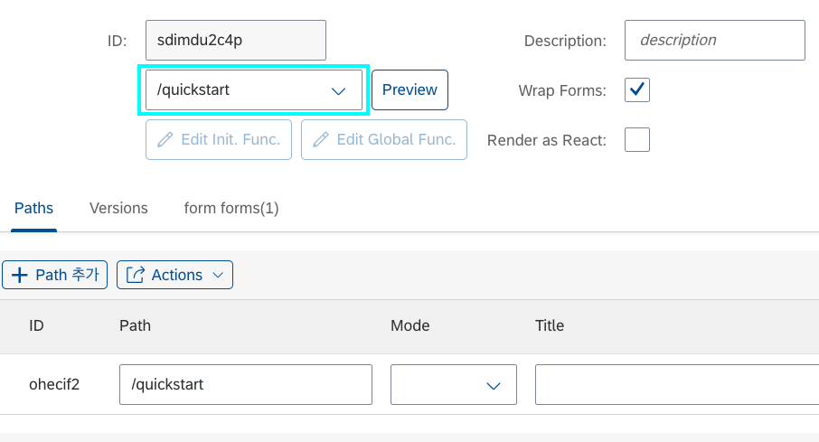

# Quick Start

이 페이지에서는 LC5를 통해 간단한 폼-테이블 구조의 회원 명단 페이지를 만드는 방법을 다룹니다. LC5에 관한 더 자세한 정보와 개념을 알고 싶으시다면 [Concepts 섹션](/lc5/concepts/)의 문서들을 참고해 주세요.

## 새 프로젝트 생성하기


LC5에 처음 접속하면 list 페이지에 리다이렉트됩니다. 이 페이지는 기존에 생성된 프로젝트를 확인 또는 편집하거나 새로운 프로젝트를 생성하기 위한 페이지입니다.

먼저 새 프로젝트를 생성해 보겠습니다. 상단의 생성 버튼을 클릭하세요.

## 프로젝트 편집하기


생성 버튼을 누르면 빌더 페이지의 Meta 편집 창으로 이동합니다.

**Meta**란 간단히 말해 LC5를 통해 생성할 페이지의 UI 정보를 담고 있는 데이터입니다. 빌더 페이지는 해당 Meta 정보를 편집하고 저장할 수 있는 GUI 툴 페이지입니다. Meta에 대해 자세히 알고 싶으면 [Meta, State 페이지](/lc5/concepts/meta_state)를, 빌더 페이지에 대해 자세히 알고 싶으면 [Builder, Renderer 페이지](/lc5/concepts/builder_renderer)를 확인하세요.

Meta를 생성하기 위해서는 먼저 ID를 지정해야 합니다. ID는 메타를 처음 저장할 때 고유한 해시 값으로 자동 생성됩니다. 좌측 상단의 **Save** 버튼을 누르세요.


Save 버튼을 누르니 ID가 생성되었습니다. ID는 Meta를 구분하기 위한 고유한 아이디 값으로 자동 배정되며 수정할 수 없습니다.

### Path 생성

Meta를 수정하기 위해서는 먼저 **Path 추가** 작업이 필요합니다. Path는 새 프로젝트와 연결될 url 경로입니다.

하단의 Paths 테이블 안에 있는 Path 추가 버튼을 클릭하세요.


Path 추가 버튼을 누르면, 테이블에 빈 input들로 이루어진 행이 추가된 것을 볼 수 있습니다. 이 테이블에 추가된 path 정보들을 통해 해당 Meta로 만든 웹 페이지를 url과 연동할 수 있습니다.

Path 컬럼에 원하는 path 세그먼트를 입력해 주세요. 단, path 값은 <span style="color:red">**백슬래시(/)로 시작하는 영문 혹은 숫자로 된 문자열**</span>이어야 합니다.

본 예제에서는 /quickstart로 입력하겠습니다. 입력 후 좌측 상단의 **Save** 버튼을 눌러주세요.



입력한 값이 위의 이미지와 같이 ID의 아래 칸에 나타났다면 성공적으로 저장된 것입니다.

path를 UI보다 먼저 추가하는 이유는, path가 지정되어야 UI Preview 기능을 활용할 수 있기 때문입니다. Preview가 무엇인지는 하단에서 설명하겠습니다.

### Form 생성

이제 폼 UI을 추가해 보겠습니다. 상단에 **Actions** 메뉴를 열고 **Add Form**을 클릭해 주세요.


하단 테이블 패널에 폼이 추가된 게 보이시나요? 간단한 클릭 한 번으로 프로젝트에 폼이 추가되었습니다.

생성된 폼이 UI에 어떻게 나타나는지 한번 확인해 보겠습니다. 먼저 Save를 누르고, 상단의 **Preview** 버튼을 눌러보세요.


Preview 버튼을 누르면, 웹 사이트의 url이 `preview/[지정한 path값]`으로 이동된 것을 확인하실 수 있습니다. 이렇듯 Preview는 지금까지 만들어둔 UI를 미리 확인할 수 있는 기능입니다.

하지만 현재 preview 페이지에는 아무것도 나오지 않습니다. 이는 우리가 Form 레이아웃만 생성하고, **내부의 컴포넌트는 하나도 채우지 않았기 때문입니다.**

그럼 Form을 한 번 채워 보도록 하겠습니다. 이전 페이지로 돌아가서 테이블 패널의 생성해둔 form 탭을 클릭하고, **container 추가** 버튼을 눌러보세요.


테이블 패널에 컨테이너 행이 추가되었습니다. 컨테이너란 Form 레이아웃의 **가로축 방향으로 쌓이는** 하위 레이아웃 단위입니다. 만약 컨테이너를 하나 더 생성하면 폼은 가로로 이등분된 두 개의 섹션을 가지게 됩니다.

우선 하나의 컨테이너로 진행하겠습니다. 생성한 컨테이너 행에 있는 **Add field** 버튼을 눌러주세요.


컨테이너 행 아래에 필드 행이 추가되었습니다. 필드는 컨테이너에 **세로축 방향으로 쌓이는** 하위 레이아웃 단위입니다.

만약 한 필드에 컴포넌트를 10개 추가하면, 모든 컴포넌트는 하나의 행에 쌓이게 됩니다. 그러니 필드를 적절히 추가하며 컴포넌트를 추가해 주는 것이 중요합니다.

그럼 이제 UI에 처음으로 보이게 될 컴포넌트를 추가해 보겠습니다. **Add Component** 버튼을 눌러 주세요.


컴포넌트까지 무사히 추가되었습니다. 이제 컴포넌트를 자세히 커스텀할 차례입니다.

추가한 컴포넌트 행에 있는 **Edit** 버튼을 눌러보세요.


컴포넌트 설정을 할 수 있는 편집 다이얼로그가 나타났습니다. 많은 필드들이 있지만, 우선 기초적인 요소만 설정하겠습니다. 편집 다이얼로그에 대한 자세한 설명은 [Builder UI](/lc5/reference/builder_ui/#_3) 페이지를 참고하세요.

먼저 상단 폼에서 **Component**를 클릭해서 Input을 선택해 주세요. 그런 다음, **Key** 값을 `name`으로 수정하도록 하겠습니다. 완성된 모습은 다음과 같습니다.


좌측 상단 **확인** 버튼을 누르고, Save 해주세요. 그리고 Preview를 눌러 보세요.


화면에 방금 설정한 Input 컴포넌트 UI가 나타났습니다.

다시 이전 페이지로 돌아가서 라벨을 추가해 보겠습니다. 이번엔 Field 행에 있는 **Edit** 버튼을 눌러 보세요.


상단 폼의 **Label** input에 `이름`을 입력하세요. 이후 다이얼로그 상단의 확인 버튼을 누르고, 아까와 같이 Save 후 Preview 버튼을 눌러 보세요.


라벨과 Input으로 구성된 폼 UI가 나타났습니다. 이제 우리는 LC5로 폼을 만드는 법을 배웠습니다.

폼에 회원 명단에 필요한 다른 필드를 추가해서 저장해 보세요. Input 말고 다른 컴포넌트를 추가해도 좋습니다. 본 예제에서는 나이 Input과 전화번호 Input을 추가했습니다.


컨테이너 title도 `회원 등록`으로 지정해 주었습니다.

### Table 생성

이제 폼 아래에 회원 리스트 테이블을 만들어 볼 차례입니다. 폼을 만들 때와 마찬가지로 **Actions** 버튼을 눌러서 **Add Table** 버튼을 클릭합니다.


테이블 편집 패널은 폼 편집 패널과 거의 유사합니다. 차이점으로는 폼의 container가 테이블엔 없고, 폼의 field 대신 **column**이 있다는 점입니다.

컬럼은 테이블의 열을 말합니다. 테이블 컬럼을 하나 추가하면, 폼의 field와 마찬가지로 Add Component 버튼이 생깁니다. 이를 통해 각 컬럼에 렌더링될 컴포넌트를 지정할 수 있습니다.

우선 테이블 컬럼들을 추가하겠습니다. 이 때, 컬럼의 라벨과 key는 **앞에서 만들었던 폼의 내부 필드들과 일치하게 설정**하도록 합니다. 이렇게 폼의 key와 테이블의 key를 맞추면 추후 데이터를 쉽게 연동할 수 있습니다.

완성된 테이블의 Builder View는 다음과 같습니다.


저장 후 Preview 페이지로 이동하면, 다음과 같은 UI가 렌더됩니다.


폼 아래에 비어있는 테이블이 생긴 모습을 확인할 수 있습니다.

### Header 생성

이제 테이블에 데이터를 쌓기 위해 폼 제출 기능을 구현해 보겠습니다.

폼에서 데이터를 입력하고 저장 버튼을 누르면, 테이블에 데이터가 하나씩 저장되는 로직입니다. 다시 빌더 페이지로 돌아가서, 이번엔 **Actions**의 **Add Header** 버튼을 눌러주세요.


**Header**는 여러 버튼들을 추가할 수 있는, 웹페이지 최상단의 레이아웃입니다.

하단 테이블 패널에 추가된 header 탭을 클릭하고 **Button 추가** 버튼을 클릭하세요. 테이블 안에 버튼 행이 생기면 Properties 컬럼의 **Edit** 버튼을 눌러 주세요.


버튼 속성 편집창입니다. 컴포넌트 편집 다이얼로그와 비슷한 구성입니다.

Text Input에 `저장` 텍스트를 입력하고, **option 추가** 버튼을 눌러 보세요.


이제 옵션을 통해 버튼에 onPress 이벤트 핸들러를 부착해서, 버튼을 누를 때 폼의 내용이 저장되는 로직을 만들어낼 것입니다.

생성된 option의 Key를 **onPress**로 입력하고, Type를 **Function**으로 지정하세요. 그런 다음 Value 쪽에 생긴 edit 버튼을 누르세요.


커스텀 함수를 연결할 수 있는 Function Editor가 열렸습니다.

상단에 있는 테이블은 현재 접근 가능한 State들의 data path입니다. 이 정보를 바탕으로 Form State에 있는 데이터를 Table State로 저장하는 로직을 작성하도록 하겠습니다.

코드 에디터에 아래 코드를 입력하세요.

```
async () => {
  return (draft) => {
    draft.tables.tables1 = [
      ...(draft.tables.tables1 || []),
      draft.forms.forms1,
    ];
    draft.forms.forms1 = {};
  };
};
```

해당 로직을 설명하자면, table State에 현재 form에 올라와 있는 데이터를 추가하고, 현재 form의 데이터를 비우는 작업입니다.

Function에 대한 자세한 설명은 [함수](/lc5/concepts/function) 페이지를 참고하세요. 또 State path의 구조에 대해 궁금하다면 [Meta, State](/lc5/concepts/meta_state/#state_1) 페이지에 자세한 설명이 나와 있습니다.

> Q. 폼의 Input에는 State에 값을 저장하는 이벤트 핸들러 로직을 직접 작성하지 않았는데, 따로 추가하지 않아도 되나요?

> A. 폼의 컴포넌트들에는 기본 onChange 이벤트 핸들러가 부착되어 있어, 폼에 입력한 데이터들이 state에 자동으로 저장되게끔 연동되어 있습니다.
> 만약 직접 컴포넌트를 control하고 싶을 경우에는, 커스텀 onChange 옵션을 추가할 수도 있습니다.

상단의 **확인** 버튼을 누르고, 저장 후 Preview를 해보세요. 그리고 폼을 채운 후 방금 생성한 저장 버튼을 눌러 보세요.


폼의 내용이 테이블로 저장되었습니다. 이로써 회원 명단 페이지가 몇 번의 클릭과 입력으로 간단하게 구현되었습니다.

본 예제에서는 간단한 코드 샘플을 위해 State를 활용하여 폼 전송을 구현했지만, 실제 LC5에서는 S3와 연결하여 지속 가능한 저장소에 데이터를 넣을 수 있는 모듈이 내장되어 있습니다. 또한, BSG Support에서는 Lambda, DynamoDB 등 AWS의 수많은 서비스들과 연동되어 복잡한 비즈니스 로직을 설계할 수 있는 서비스인 **API-Hub**(이하 IHub)를 제공합니다. LC5에 IHub를 연동해서 사용한다면, 여러 서비스를 아우르는 복잡한 로직을 LC5에 간단하게 붙일 수 있습니다. 그러므로 LC5를 통해 개발하고 있는 프로젝트의 복잡성이 올라간다면, IHub 연동을 추천드립니다.

좀 더 심화적인 프로젝트 구성을 원한다면 [Concepts 섹션](/lc5/concepts/)을 둘러보시고 LC5로 어디까지 만들 수 있는지 시험해 보세요.
