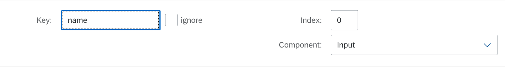

# Builder UI 세부사항

이번 장에서는 Builder 페이지의 UI를 통해 설정할 수 있는 각종 옵션 및 프로퍼티에 대한 세부 설명을 다루도록 하겠습니다.

## UI 구성 요소

LC5 빌더 툴의 UI는 크게 다음과 같은 주요 구성 요소로 나눌 수 있습니다.

1. 상단 툴바 : 레이아웃 컴포넌트 추가, 리스트 페이지로 이동, 저장 등 주요 기능을 빠르게 접근할 수 있는 메뉴가 위치합니다.
2. Meta 설정 폼 : 빌더를 사용해 생성한 Meta 데이터 관련 설정을 할 수 있는 폼입니다.
3. 하단 패널 : 추가한 레이아웃들에 대한 조회와 각 레이아웃에 대한 설정, 컴포넌트 추가 및 배치를 할 수 있는 테이블 형태의 레이아웃입니다.
4. 편집 다이얼로그 : 선택한 컴포넌트 혹은 레이아웃에 대한 구체적인 속성 편집 및 추가를 할 수 있는 다이얼로그 형태의 레이아웃입니다.

이 페이지에서는 각 UI 구성 요소의 사용 방법과 옵션에 대한 상세 설명을 제공합니다.

## 상단 툴바

## Form Edit

## Table Edit

## Header Edit

## Component Edit Dialog

LC5 빌더에서 컴포넌트를 추가하고 나면, `Edit` 버튼을 통해 컴포넌트의 상세 설정을 할 수 있는 다이얼로그에 접근할 수 있습니다.

다이얼로그의 상단부에는 컴포넌트에 관한 설정을 할 수 있는 폼이, 하단부에는 컴포넌트에 전달되는 속성(properties, 이하 컴포넌트 옵션)을 관리할 수 있는 테이블이 있습니다. 각 파트에 대해 간략하게 설명드리도록 하겠습니다.

### 상단부 폼

- Key : 컴포넌트 Key를 설정할 수 있는 필드입니다. 컴포넌트 Key의 쓰임에 대한 설명은 [Meta, State](/lc5/concepts/meta_state/#key-key)를 참고하세요.
- ignore : 생성한 컴포넌트를 삭제하고 싶을 경우 설정할 수 있는 속성입니다. ignore로 표시된 컴포넌트는 렌더러 페이지에서 표시되지 않습니다. 이는 기존 데이터를 유지하면서 렌더러에서는 없애고 싶을 때 유용합니다.
- Index : 부모 레이아웃에서 해당 컴포넌트의 등장 순서를 설정할 수 있는 속성입니다. 현재는 첫 번째로 표시되는 컴포넌트이기 때문에 0 값을 가지지만, 다른 값을 줄 경우 컴포넌트가 다른 순서로 배치됩니다.
- Component : 해당 컴포넌트의 타입을 결정할 수 있는 속성입니다. 컴포넌트 타입 리스트에 관해서는 미리 정의된 컴포넌트 문서의 [세부 컴포넌트 섹션](/lc5/concepts/prebuilt_components/#_3)을 참고하세요.

### 하단부 테이블

- Key : 컴포넌트 옵션 키입니다. 설정하고자 하는 옵션의 이름을 지정합니다.
  셀렉트 박스 오픈 시 지정한 컴포넌트 타입에 따라 추천 옵션이 주어집니다.
- ignore : 위에서 설명했던 ignore 속성과 동일합니다. 체크 시 해당 옵션은 적용되지 않습니다.
- Type : 컴포넌트 옵션 value를 할당하는 방법을 지정합니다. 모든 컴포넌트가 동일하며, **Array, Boolean, Function, Number, Path, String** 타입이 있습니다. 각 타입에 대한 구체적인 설명은 아래 섹션을 참고해 주세요.
- Value : 컴포넌트 옵션 value를 지정합니다. Type에서 어떤 방식을 선택했느냐에 따라 코드를 입력할 수도 있고, 단순 텍스트를 입력할 수도 있습니다.

### Option Type

옵션 타입은 컴포넌트 옵션에 값을 전달하는 방법을 정의하는 것과 같습니다. 각 타입에 대해 설명하자면 다음과 같습니다.

#### Array

Array 타입은 특수한 타입으로, 폼 편집 다이얼로그의 table 속성에만 적용할 수 있습니다. 폼 다이얼로그에서 table 프로퍼티로 Array 타입 옵션을 생성하면, 멀티 셀렉트 컴포넌트가 Value 컬럼에 나타나며 현재 빌더 페이지에서 생성해 둔 테이블들의 key가 선택지로 주어집니다. **만약 여기서 특정 테이블을 선택하면, 해당 폼의 화면에서는 지정한 테이블만 보이게 되고, 다른 폼을 열었을 때 그 테이블이 보이지 않게 됩니다.** 이는 폼에 따라 특정한 테이블을 보여주고 싶을 때 유용합니다.

#### Boolean, Number, String

각 이름에 해당하는 JavaScript 원시 데이터를 설정할 수 있는 타입입니다. 입력 시 따옴표를 추가할 필요는 없으며 지정할 데이터를 그대로 입력하면 됩니다.

기본적으로 설정한 값이 그대로 각 타입으로 변환되어 전달되지만, 데이터 바인딩을 사용하여 동적인 State 접근을 할 수도 있습니다. 데이터 바인딩에 대한 설명은 다음 섹션을 참고하세요.

#### Function

컴포넌트 값, 혹은 컴포넌트 이벤트 핸들러로 지정할 수 있는 함수입니다. 코드 에디터를 통해 함수 로직을 작성할 수 있으며 현재는 JS 함수만 지원합니다.

Function은 Option Key로 `onPress`, `onChange` 같이 해당 컴포넌트에 사용가능한 이벤트 핸들러 타입을 부여할 경우 async Function으로 처리되고, 나머지 경우는 non-async Function으로 처리됩니다. async Function과 non-async Function에 대한 설명은 [Function 페이지](/lc5/concepts/function/#-_1)를 참고하세요.

#### Path

[State](/lc5/concepts/meta_state/#state)의 경로를 따라 할당되는 값입니다. 예를 들어 위 예시처럼 `state.forms.forms1.name`으로 설정했을 경우, state 객체 안의 해당 경로에 해당하는 데이터가 value에 전달되게 됩니다.
